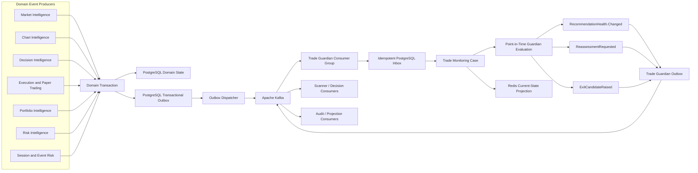

# ADR-0003: Kafka Event Backbone and Trade Guardian Point-in-Time Monitoring

- Status: Accepted
- Date: 2026-07-30

## Context

PredictiveEdge is designed as an event-driven trading-intelligence platform. Market Intelligence, Chart Intelligence, Decision Intelligence, Risk Intelligence, Portfolio Intelligence, broker execution, paper trading, and Trade Guardian must collaborate without synchronous coupling or loss of decision evidence.

Trade Guardian must preserve the exact state used to create a recommendation and compare it with later market, chart, order, position, portfolio, risk, session, and event-risk states. Its evaluations must be reproducible in live capture, replay, paper trading, and backtesting.

The current implementation has synchronous broker operations and in-memory paper state. It has no shared domain-event contract, event broker, transactional outbox/inbox, durable consumer checkpoint, Market Context event, Decision Context Bundle event, or Trade Guardian event consumer.

Point-in-time correctness requires more than message arrival order. Every evaluation must distinguish:

- when a market or business fact became effective;
- when PredictiveEdge received and validated it;
- when it became legally and technically usable;
- which source and artifact versions produced it;
- which events had been processed by a consumer;
- which information was unavailable at the evaluation cutoff.

## Decision

Apache Kafka is the primary inter-module event-streaming framework for PredictiveEdge.

The event architecture is:

1. PostgreSQL remains the authoritative store for domain state, immutable context versions, recommendation evidence, Trade Guardian evaluations, outbox records, inbox deduplication, and audit history.
2. Each state-changing transaction writes its domain state and outbox event in the same PostgreSQL transaction.
3. An outbox dispatcher publishes committed events to Kafka.
4. Kafka provides durable event transport, partition ordering, consumer groups, independent subscribers, replay, and retention.
5. Every database-writing Kafka consumer records the event ID and its state change in one PostgreSQL inbox transaction before committing the Kafka offset.
6. Redis remains a replaceable cache and current-state projection. Redis Pub/Sub and Redis Streams are not the authoritative platform event backbone.
7. Kafka shall run in KRaft mode. ZooKeeper shall not be introduced.
8. Trade Guardian consumes governed domain events and publishes recommendation-health facts. It shall never place, modify, or cancel an order directly.

Kafka is not the sole system of record. The transactional outbox/inbox pattern is mandatory because a direct database-plus-Kafka dual write cannot guarantee atomicity across both systems.

## Event architecture



## Shared event envelope

Domain payloads remain owned by their producing bounded contexts. A small shared eventing contract owns only transport-neutral envelope semantics.

```text
EventEnvelope {
  eventId,
  eventType,
  schemaVersion,
  producer,
  aggregateType,
  aggregateId,
  aggregateVersion,
  partitionKey,
  occurredAt,
  effectiveAt,
  availableAt,
  publishedAt,
  analysisCutoff,
  knowledgeCutoff,
  correlationId,
  causationId,
  traderIntentId?,
  recommendationId?,
  tradeId?,
  accountId?,
  contextReferences[],
  evidenceManifestRef?,
  payload,
  payloadHash,
  classification
}
```

Rules:

- `eventId` is globally unique and is the consumer idempotency key.
- `aggregateVersion` is monotonic within an aggregate and supports gap and stale-event detection.
- `partitionKey` preserves ordering for the business entity that requires it.
- `occurredAt` records when the producer completed the business fact.
- `effectiveAt` records when the fact applies in business/market time.
- `availableAt` is the earliest instant the fact was permitted to influence platform intelligence.
- `publishedAt` records when the event was appended to Kafka.
- Context references identify immutable versions; consumers shall not substitute a later context.
- Payloads must not contain broker credentials, API secrets, raw licensed news bodies, or unnecessary personal data.
- JSON payloads and JSON Schemas are the initial interoperable representation. Schemas are version-controlled and compatibility-checked in CI.

An event is eligible for a point-in-time evaluation only when:

```text
event.effectiveAt <= analysisCutoff
AND event.availableAt <= knowledgeCutoff
AND the event revision was known at knowledgeCutoff
```

## Topic topology

Initial domain topics:

| Topic | Primary producers | Primary consumers | Partition key |
|---|---|---|---|
| `pe.market-context.v1` | Market Intelligence | Decision, Scanner, Trade Guardian | `scopeId:horizon` |
| `pe.chart-context.v1` | Chart Intelligence | Decision, Scanner, Trade Guardian | `instrumentId:timeframe` |
| `pe.decisions.v1` | Decision Intelligence | Risk, Trade Planner, Trade Guardian, audit | `recommendationId` |
| `pe.orders.v1` | Execution Gateway and paper execution | Portfolio, Trade Guardian, audit | `tradeId` |
| `pe.positions.v1` | Portfolio Intelligence | Risk, Trade Guardian, reporting | `accountId:instrumentId` |
| `pe.risk.v1` | Risk Intelligence | Decision, Execution Gateway, Trade Guardian | `accountId` |
| `pe.session-events.v1` | Session and Calendar Intelligence | Market/Chart Intelligence, Trade Guardian | `venueId:sessionId` |
| `pe.trade-guardian.v1` | Trade Guardian | Decision, Risk, notifications, audit | `recommendationId` |

High-volume market-data topics are a separate data plane:

| Topic family | Purpose | Typical partition key |
|---|---|---|
| `pe.market-data.trades.v1` | Canonical trade observations | `venueId:instrumentId` |
| `pe.market-data.quotes.v1` | Canonical quote observations | `venueId:instrumentId` |
| `pe.market-data.bars.v1` | Provisional, final, and corrected canonical bars | `venueId:instrumentId:timeframe` |

Raw provider payload retention, entitlements, and redistribution restrictions remain governed by the Market Data Platform. High-frequency observations shall not be mixed into low-volume business-domain topics.

Topic names are versioned only for breaking contract changes. Compatible schema evolution remains inside the same topic version.

## Partitioning and ordering

Kafka guarantees ordering within a partition, not across all partitions. Producers must therefore use the governed partition key for every event.

Required ordering domains:

- recommendation and Trade Guardian lifecycle: `recommendationId`;
- order and fill lifecycle: `tradeId`;
- position lifecycle: `accountId:instrumentId`;
- market context lifecycle: `scopeId:horizon`;
- chart context lifecycle: `instrumentId:timeframe`;
- market-data observations: `venueId:instrumentId`, extended with timeframe for bars.

Consumers must not infer global ordering from Kafka offsets belonging to different partitions. Cross-topic or cross-partition evaluations use `effectiveAt`, `availableAt`, context versions, source watermarks, and an explicit `knowledgeCutoff`.

## Delivery and processing semantics

The default contract is at-least-once delivery with idempotent processing.

Producer requirements:

- enable idempotent production;
- require acknowledgment from all in-sync replicas in production;
- use deterministic event IDs and keys;
- retry transient publication failures;
- publish only committed outbox rows;
- retain publication attempt and broker metadata for operations.

Consumer requirements:

- disable automatic offset commit for state-changing consumers;
- validate envelope and payload schema before processing;
- write inbox event ID, domain changes, and newly produced outbox events in one database transaction;
- commit the Kafka offset only after that transaction succeeds;
- ignore already-processed event IDs;
- detect aggregate-version gaps and quarantine affected processing where ordering is material;
- implement bounded retries and a governed dead-letter path;
- preserve original payload, headers, failure reason, attempt count, and source coordinates in dead-letter evidence.

Kafka exactly-once processing may be used for Kafka-to-Kafka transformations. It does not remove the need for PostgreSQL inbox idempotency when the consumer writes to PostgreSQL or another external system.

## Transactional outbox and inbox

Minimum outbox fields:

```text
outboxId
eventId
eventType
aggregateId
aggregateVersion
partitionKey
payload
payloadHash
schemaVersion
createdAt
publishState
publishedAt
attemptCount
lastFailure
brokerTopic
brokerPartition
brokerOffset
```

Minimum inbox fields:

```text
consumerName
eventId
eventType
aggregateId
aggregateVersion
topic
partition
offset
receivedAt
processedAt
processingOutcome
```

Outbox publication may produce a duplicate if the process fails after Kafka acknowledgment but before marking the row as published. This is expected and is handled by consumer inbox idempotency.

## Trade Guardian integration

### Monitoring state

Trade Guardian maintains one `TradeMonitoringCase` per recommendation/trade lifecycle:

```text
TradeMonitoringCase {
  recommendationId,
  tradeId?,
  traderIntentVersion,
  originalDecisionContextBundleRef,
  originalMarketContextRef,
  originalChartContextRef,
  originalFeatureSnapshotRef,
  approvedTradePlanRef,
  riskApprovalRef,
  currentOrderStateRef?,
  currentPositionStateRef?,
  lastMarketContextRef?,
  lastChartContextRef?,
  lastPortfolioSnapshotRef?,
  lastRiskStateRef?,
  sourceWatermarks,
  processedEventCheckpoints,
  monitoringState,
  lastEvaluationRef
}
```

The original decision bundle is immutable. Current context is compared with it; it never replaces it.

### Input events

Trade Guardian initially consumes:

- `Decision.RecommendationCreated`
- `Decision.TradePlanApproved`
- `Decision.RecommendationCancelled`
- `MarketContext.Published`
- `ChartContext.Published`
- `Order.Accepted`
- `Order.PartiallyFilled`
- `Order.Filled`
- `Order.Rejected`
- `Order.Cancelled`
- `Position.Opened`
- `Position.Changed`
- `Position.Closed`
- `RiskState.Changed`
- `RiskLimit.Breached`
- `TraderIntent.Expired`
- `MarketSession.PhaseChanged`
- `Instrument.Halted`
- `EventRisk.Changed`
- `GuardianEvaluation.Due`

### Output events

Trade Guardian publishes:

- `RecommendationHealth.Changed`
- `TradeGuardian.ReassessmentRequested`
- `TradeGuardian.RiskTighteningSuggested`
- `TradeGuardian.PartialExitSuggested`
- `TradeGuardian.ExitCandidateRaised`
- `TradeGuardian.MonitoringSuspended`
- `TradeGuardian.MonitoringResumed`
- `TradeGuardian.MonitoringCompleted`

Trade Guardian outputs are advisory facts. Decision Intelligence and Risk Intelligence reassess the recommendation; the trader or an explicitly approved execution mandate authorizes execution.

### Evaluation triggers

A Guardian evaluation occurs when:

- a referenced Market or Chart Context changes materially;
- an entry, target, stop, invalidation, or time-stop condition is approached or crossed;
- an order or position lifecycle event occurs;
- risk, exposure, liquidity, volatility, event-risk, halt, or session state changes;
- required data becomes stale, unavailable, corrected, or restored;
- the governed heartbeat/time evaluation is due.

The evaluation records its exact Kafka coordinates, inbox checkpoint, input context versions, analysis cutoff, knowledge cutoff, rule/model versions, and output reason codes.

## Redis responsibility

Redis remains useful for:

- replaceable latest-context projections;
- low-latency Trade Guardian current-state reads;
- short-lived session and throttling state;
- non-authoritative caches.

Redis data loss must not destroy the ability to reconstruct a Trade Guardian case. Redis projections are rebuilt from PostgreSQL state and Kafka replay.

Redis Pub/Sub is prohibited for mandatory domain-event delivery because disconnected consumers cannot replay missed messages.

## Retention and compaction

- Immutable business-event topics use time/size retention appropriate to replay and operational recovery. PostgreSQL retains the governed long-term audit record.
- Raw market-data retention is governed separately by data volume, entitlements, and replay requirements.
- Compacted topics may be added for replaceable latest-state projections.
- Immutable audit-event topics shall not use compaction as a substitute for event history.
- Deletion, compaction, and tombstone policies are explicit per topic and reviewed with consumer recovery requirements.
- A consumer must be able to recover before its required source events expire.

## Security and governance

- Use TLS and authenticated Kafka clients outside local development.
- Apply least-privilege topic ACLs by producer and consumer identity.
- Separate production, paper, backtest, replay, and test environments by cluster or enforceable topic namespace and credentials.
- Never allow backtest or replay events to enter authoritative live topics.
- Validate schemas and maximum event size before publishing.
- Encrypt sensitive storage at rest through the deployment platform.
- Record schema, producer build, rule/model, and source versions.
- Redact secrets and restricted raw content from logs and dead-letter records.
- Govern topic creation, partition changes, retention changes, and breaking schema changes through architecture and operations review.

## Observability

Required operational signals:

- outbox age, backlog, attempt count, and publication failure rate;
- producer error, retry, acknowledgment, and serialization rates;
- consumer lag by group/topic/partition;
- processing latency, retry count, duplicate rate, and inbox conflicts;
- aggregate-version gaps and out-of-order quarantines;
- dead-letter volume and oldest unresolved failure;
- under-replicated and offline partitions;
- end-to-end `occurredAt` to `processedAt` latency;
- Trade Guardian evaluation age and active monitoring-case count;
- live/replay result-hash mismatch count.

All traces carry event ID, correlation ID, causation ID, recommendation ID, trade ID, context references, topic, partition, and offset where applicable.

## Modules

The initial modular-monolith implementation adds:

```text
platform-eventing-contracts
platform-eventing-application
platform-eventing-infrastructure
platform-eventing-testkit

trade-guardian-domain
trade-guardian-application
trade-guardian-infrastructure
trade-guardian-testkit
```

Domain events are declared by their owning bounded-context contract modules. The generic eventing modules must not become owners of market, decision, order, position, risk, or Guardian semantics.

## Phased delivery

### Phase 0: event foundation

- Canonical event envelope and schema compatibility rules.
- PostgreSQL outbox and inbox.
- Kafka KRaft local environment.
- Publisher and consumer ports.
- Dispatcher, idempotency, retry, dead-letter, and observability.
- Contract and failure-recovery test kit.

### Phase 1: execution lifecycle

- Paper order, fill, account, and position events.
- Immutable recommendation and Trade Plan events.
- Minimal Trade Monitoring Case.
- Restart and replay recovery.

### Phase 2: intelligence lifecycle

- Market Context, Chart Context, risk, session, and event-risk events.
- Point-in-time Guardian evaluation.
- Recommendation-health events and Decision Intelligence reassessment.

### Phase 3: high-volume data plane

- Canonical trades, quotes, and bar topics.
- Partition and retention capacity validation.
- Stream processing and materialized feature/context projections.

## Acceptance criteria

- A committed domain transaction cannot lose its outbox event.
- A rolled-back domain transaction cannot publish an event.
- Duplicate Kafka delivery produces one domain effect.
- A consumer failure before offset commit is recovered without losing the event.
- Out-of-order or missing aggregate versions are detected and governed.
- A recommendation retains exact original context references for its entire lifecycle.
- Events unavailable at the knowledge cutoff cannot influence a Guardian evaluation.
- Replaying the same ordered events and artifact versions reproduces the same Guardian output hash.
- Redis loss does not destroy authoritative state or replay capability.
- Backtest, replay, paper, and live events cannot contaminate one another.
- Trade Guardian cannot invoke the Broker SPI or execution transport.
- Schema compatibility and topic-contract tests run in CI.

## Alternatives considered

### Redis Streams as the primary event backbone

Rejected as the primary platform backbone. Redis remains useful for cache and current-state projections, but Kafka provides the preferred long-lived, partitioned, independently consumable event log for the planned number of producers, consumers, replay workflows, and high-volume market-data streams.

### Hazelcast

Rejected for this responsibility. Hazelcast is valuable for distributed in-memory state and colocated stream processing, but it would introduce a second in-memory platform while Kafka better matches the durable event-log, replay, partitioning, and consumer-group requirements.

### PostgreSQL polling without Kafka

Rejected as the end-state event backbone. PostgreSQL remains the transactional source and outbox/inbox store, but database polling alone would couple every consumer to the operational database and provide a weaker high-volume streaming path.

### Direct database and Kafka dual writes

Rejected because partial failure can commit one side without the other. The transactional outbox/inbox pattern is mandatory.

### Kafka without PostgreSQL audit persistence

Rejected because topic retention and compaction policies are operational concerns and do not replace immutable domain evidence, bitemporal queries, or regulated audit requirements.

## Consequences

- PredictiveEdge gains an ordered, replayable, independently consumable event backbone.
- Trade Guardian can reconstruct and review the exact lifecycle of a recommendation and trade.
- Market data and business-domain events have separate scaling and retention policies.
- Producers and consumers remain decoupled through governed contracts.
- PostgreSQL, Kafka, and Redis have distinct, non-overlapping responsibilities.
- At-least-once processing requires idempotent consumers and durable inbox records.
- Kafka introduces additional local, CI, operational, security, schema, monitoring, and capacity-management work.
- Existing synchronous modules must add outbox event publication incrementally without leaking Kafka APIs into domain code.

## Official references

- Apache Kafka introduction: https://kafka.apache.org/documentation/
- Apache Kafka quickstart and KRaft setup: https://kafka.apache.org/quickstart/
- Apache Kafka design and delivery semantics: https://kafka.apache.org/documentation/#design
- Apache Kafka log compaction: https://kafka.apache.org/documentation/#compaction
