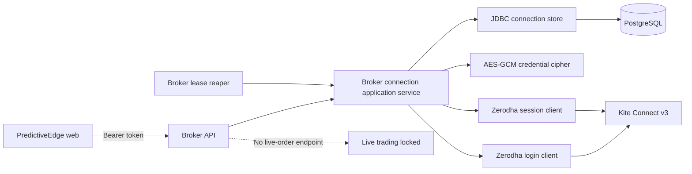
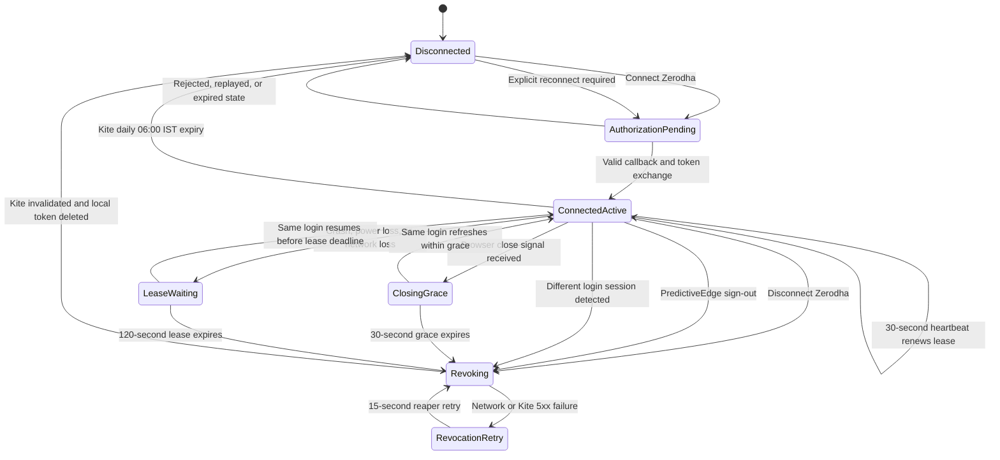

# Broker connection architecture and lifecycle

## Scope

This design connects an authenticated PredictiveEdge user to a personal Zerodha Kite Connect app for historical market data and backtesting. Paper trading is always local. Live order execution is not part of this lifecycle and remains disabled.

Official protocol references:

- Kite Connect v3 login and token exchange: <https://kite.trade/docs/connect/v3/user/>
- Zerodha Java client reference: <https://github.com/zerodha/javakiteconnect/tree/master>

## Architecture



Responsibilities:

| Component | Responsibility |
|---|---|
| Web UI | Shows one valid action, renews the browser lease, and sends a best-effort close signal |
| Broker API | Authenticates the PredictiveEdge user and exposes connection commands/status |
| Application service | Owns state transitions, idempotency, expiry, and remote-first disconnect rules |
| Zerodha adapter | Implements the documented v3 login, checksum exchange, and session invalidation calls |
| Credential cipher | Encrypts access tokens with randomized AES-256-GCM before persistence |
| Connection store | Persists one session-bound connection, its short lease, revocation claim, and one-time login states |
| Lease reaper | Claims expired leases and invalidates their Kite sessions without racing another worker |

The API key and secret are server configuration. The API secret and Kite access token are never returned to the browser.

## Conceptual lifecycle



`AuthorizationPending`, `LeaseExpiring`, `Disconnecting`, and daily expiry are short-lived application states. A revocation claim prevents a heartbeat or another worker from resurrecting a session while its Kite token is being invalidated.

## Connect sequence

1. The authenticated UI loads `GET /api/broker/v1/connections`.
2. If no active row exists, the UI shows **Connect Zerodha**.
3. `POST /api/broker/v1/zerodha/connect` rejects an already-connected user with `409`.
4. The service hashes the current PredictiveEdge bearer token, generates 256 bits of random state, and stores the state hash, user ID, session hash, and ten-minute expiry.
5. Zerodha authenticates and redirects to the registered callback with `request_token` and the returned state.
6. The callback consumes the state exactly once. Missing, expired, reused, or user-unbound state is rejected.
7. The server exchanges `request_token` plus `SHA-256(api_key + request_token + api_secret)` for an access token.
8. The access token is AES-GCM encrypted and upserted with the Zerodha account ID, hashed owner session, connection time, and a two-minute browser lease.
9. The browser returns to the workspace. The card now shows **Connected**, account ID, session expiry, and **Disconnect Zerodha**. It no longer offers Connect.

## Disconnect sequence

1. The connected card requires an explicit confirmation.
2. `DELETE /api/broker/v1/zerodha/connection` loads and decrypts the user's token server-side.
3. The server calls Kite `DELETE /session/token` using that API key and access token.
4. A successful response, or `403` indicating the token is already invalid, is treated as a completed remote logout.
5. Only then is the local encrypted connection deleted.
6. The refreshed UI returns to **Connect Zerodha**.

The DELETE command is idempotent: if no local connection exists, it returns `204`. If Zerodha is unavailable, the service returns an error and retains the local row; it does not falsely claim the remote session was killed.

## Browser close, crash, and new-login behavior

Browsers cannot guarantee an HTTP request at the instant a window closes. A process crash, power loss, operating-system suspension, or dropped network can prevent all unload traffic. The lifecycle therefore does not trust a browser-close event as its only security control.

```mermaid
sequenceDiagram
    actor User
    participant UI as Browser
    participant API as Broker API
    participant DB as Connection Store
    participant Reaper as Lease Reaper
    participant Kite as Kite Connect

    User->>UI: Connect Zerodha
    UI->>API: Start authorization with bearer token
    API->>DB: Store state hash and owner-session hash
    API-->>UI: Kite authorization URL
    UI->>Kite: Authenticate and authorize
    Kite->>API: Callback with request_token and state
    API->>DB: Store encrypted token and 120-second lease

    loop While this PredictiveEdge login remains open
        UI->>API: GET connections with same bearer token
        API->>DB: Renew session-bound lease every 30 seconds
    end

    alt Browser delivers pagehide close signal
        UI-->>API: Release browser lease
        API->>DB: Shorten lease to 30-second grace
    else Crash, power loss, or network loss
        Note over UI,DB: No close request arrives; 120-second lease expires naturally
    end

    alt Same login refreshes or resumes before expiry
        UI->>API: Heartbeat with matching bearer token
        API->>DB: Renew lease and keep connection active
    else Lease expires or a different login is detected
        Note over API,DB: New bearer-token hash cannot inherit old broker session
    end

    Reaper->>DB: Atomically claim expired lease
    Reaper->>Kite: DELETE /session/token
    alt Kite confirms logout or token is already invalid
        Kite-->>Reaper: Success or 403
        Reaper->>DB: Delete matching encrypted connection
        API-->>UI: Disconnected; explicit reconnect required
    else Kite or network failure
        Kite--xReaper: Network error or 5xx
        Reaper->>DB: Release claim for next 15-second retry
    end
```

- Normal heartbeats extend the lease to two minutes.
- A delivered close signal shortens it to 30 seconds; the 15-second reaper then revokes it.
- If the close signal is lost, revocation occurs after the two-minute lease plus the reaper interval.
- Refresh/navigation can renew the same login during the grace period.
- A new PredictiveEdge login has a different bearer-token hash. It cannot inherit the old connection and triggers immediate old-session revocation before showing Connect.
- PredictiveEdge **Sign out** explicitly disconnects Zerodha before ending the identity session; the lease reaper remains the fallback.

Thus “closed” is a bounded server-side timeout rather than an unreliable promise of instantaneous browser notification.

## Kite session expiry and invalidation

Kite access tokens expire at 06:00 IST on the next day. The overview path calculates that boundary from `connected_at`, removes stale rows, and presents the user as disconnected. A future broker-data call that receives Kite `403 TokenException` must follow the same invalidation policy: delete the unusable local token and require reconnection. Kite Connect does not provide a general refresh token for retail applications.

PredictiveEdge sign-out, explicit disconnect, browser lease expiry, and detection of a different PredictiveEdge login all converge on the same remote-first Zerodha revocation path.

## API contract

| Method | Path | Result |
|---|---|---|
| GET | `/api/broker/v1/connections` | Configuration, connection, account, timestamps, paper/backtest/live capabilities |
| POST | `/api/broker/v1/zerodha/connect` | One-time authorization URL; `409` when already connected |
| GET | `/api/broker/v1/zerodha/callback` | Public callback protected by one-time state; redirects to web UI |
| POST | `/api/broker/v1/zerodha/lease/release` | Best-effort page-close signal that shortens the browser lease |
| DELETE | `/api/broker/v1/zerodha/connection` | Remote Kite logout followed by local deletion; idempotent `204` |

All endpoints except the callback require a valid PredictiveEdge bearer token. The callback does not trust browser identity; possession and one-time consumption of the hashed state binds it to the initiating user.

## Security and operating invariants

1. At most one active Zerodha connection exists per PredictiveEdge user.
2. A connected user cannot start another authorization flow.
3. A broker connection belongs to one hashed PredictiveEdge login session and cannot transfer to a later login.
4. Browser presence is proven by a renewable, expiring server-side lease—not assumed from frontend state.
5. Raw API secrets and access tokens never reach frontend code, logs, errors, or API responses.
6. Access tokens are encrypted at rest and decrypted only for an outbound Kite request.
7. Disconnect is remote-first; uncertain remote failure retains local evidence and is retried by the reaper.
8. Expired or already-invalid tokens are safe to clean locally.
9. Paper trading and backtesting cannot place a live broker order.
10. No live-order API is exposed until separate risk, audit, approval, and kill-switch controls are designed and accepted.

## Failure behavior

| Failure | Behavior |
|---|---|
| Missing server API credentials | `503`; UI shows setup required |
| Already connected | `409`; existing session is preserved |
| Invalid/expired/replayed state | `400`; no token is stored |
| Token exchange rejected | `502`; authorization must restart |
| Remote disconnect succeeds | Local token deleted, `204` |
| Remote token already invalid (`403`) | Local token deleted, `204` |
| Remote disconnect network/5xx failure | Local token retained, `502`, retry allowed |
| Browser closes and close signal arrives | Lease shortened; Kite session revoked after grace window |
| Browser crashes or close signal is lost | Kite session revoked after the two-minute lease expires |
| User logs in again | Old session hash mismatch; old Kite session revoked; explicit reconnect required |
| Daily token expiry reached | Local token removed, UI returns to disconnected |

## Configuration

```text
PE_ZERODHA_API_KEY=<public Kite app API key>
PE_ZERODHA_API_SECRET=<server-only Kite app secret>
PE_BROKER_CREDENTIAL_KEY=<at least 32 characters; production secret manager value>
PE_BROKER_BROWSER_LEASE_SECONDS=120
PE_BROKER_BROWSER_CLOSE_GRACE_SECONDS=30
PE_BROKER_LEASE_SWEEP_MILLISECONDS=15000
PE_WEB_BASE_URL=http://localhost:3000/
```

The Kite developer-console redirect URL for local deployment is:

```text
http://localhost:8080/api/broker/v1/zerodha/callback
```
