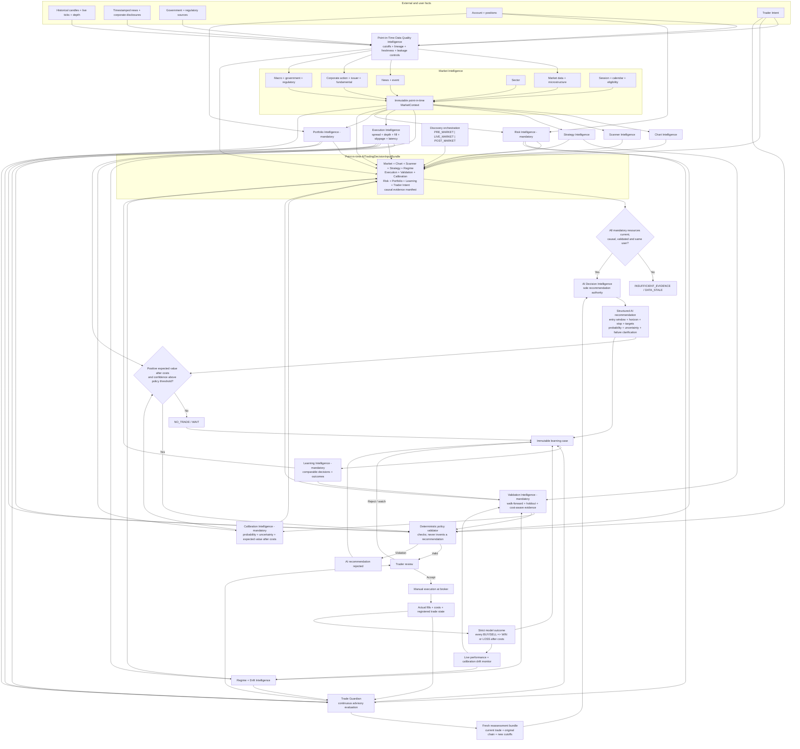

# PredictiveEdge AI Decision Intelligence Architecture v0.2

| Field | Value |
|---|---|
| Status | Founder-confirmed target architecture |
| Date | 2026-08-10 |
| Recommendation authority | AI Decision Intelligence only |
| Application authority | Point-in-time data, deterministic resources, validation, persistence and audit |
| Human boundary | AI recommends; the trader decides and executes manually |

## 1. Authority boundary

The application supplies governed facts, deterministic features, validated model
evidence, user constraints and immutable audit records. It does not originate a
trade recommendation. **AI Decision Intelligence is the sole component allowed
to produce `BUY`, `SELL`, `WAIT`, `NO_TRADE`, `INSUFFICIENT_EVIDENCE` or a linked
trade-management recommendation.**

Post-AI gates may reject an incomplete, unsafe, unvalidated or negative-edge
response. They may not create or substitute another recommendation. Every
recommendation remains advisory and requires trader review and manual execution.

## 2. Authoritative intelligence list

Every initial or trade-management evaluation receives these mandatory resources:

1. **Market Intelligence** - market data and microstructure; news and events;
   corporate actions, issuer and fundamentals; sector; macro, government and
   regulation; session, calendar and instrument eligibility.
2. **Chart Intelligence** - deterministic chart features, levels, patterns,
   readiness, supporting evidence and contradicting evidence.
3. **Scanner Intelligence** - discovery rank, liquidity, eligibility and the
   evidence explaining why the equity became a candidate.
4. **Strategy Intelligence** - applicable approved strategies, compatibility,
   governed parameters and historical validation references.
5. **Risk Intelligence** - current, user-specific capacity, loss/drawdown limits,
   size ceilings, restrictions, kill switches and status.
6. **Portfolio Intelligence** - current, user-specific capital, holdings, open
   risk, concentration, correlations and portfolio restrictions.
7. **Learning Intelligence** - comparable recommendations, frozen outcomes,
   executed-trade results, failure evidence and trader feedback. It is a
   mandatory source and sink.
8. **Point-in-Time Data Quality Intelligence** - source lineage, exchange and
   ingestion timestamps, causal cutoffs, freshness, completeness, symbol/token
   history, adjustment version and leakage checks.
9. **Regime and Drift Intelligence** - volatility, trend/range, liquidity,
   gap/event, index/stock-specific and session regimes plus feature, prediction,
   calibration and outcome drift.
10. **Execution Intelligence** - current bid/ask, depth, spread, estimated fill,
    slippage, brokerage/taxes, order-size impact, latency, entry feasibility and
    exit feasibility.
11. **Validation Intelligence** - cost-aware walk-forward and untouched holdout
    evidence, baseline comparison, regime results, paper/shadow performance,
    model approval and expiry status.
12. **Calibration Intelligence** - calibrated probability, uncertainty,
    expected return after all costs, confidence cohort size, threshold version
    and abstention evidence.

`TraderIntent` is mandatory authorization and decision context, but is not an
intelligence module. Trade Guardian is the post-recommendation monitoring and
reassessment loop. Community Intelligence remains excluded from the initial
personal-use recommendation path.

## 3. Complete architecture

Editable source:
[`diagrams/ai-decision-intelligence-architecture-v0.2.mmd`](./diagrams/ai-decision-intelligence-architecture-v0.2.mmd).



## 4. Decision-readiness gate

An actionable recommendation is eligible for trader review only when:

- all point-in-time inputs are causal, complete enough and within freshness SLA;
- Risk and Portfolio context belongs to the same user and is not `BLOCKED`;
- the instrument, session and order are eligible;
- the applicable strategy/model validation is approved and unexpired;
- live execution remains feasible for the proposed size and entry window;
- calibrated probability and uncertainty satisfy the versioned policy; and
- expected value after spread, slippage, brokerage, taxes and estimated impact
  is positive.

Failure produces `WAIT`, `NO_TRADE`, `DATA_STALE` or
`INSUFFICIENT_EVIDENCE`. The gate never changes BUY to SELL or SELL to BUY.

Expected value is evaluated as:

```text
expectedValueAfterCosts =
    calibratedWinProbability * averageNetWin
  - calibratedLossProbability * averageNetLoss
  - remainingExecutionCosts
```

Binary WIN/LOSS remains the outcome ledger. Win rate is not the only promotion
metric; model approval also considers expectancy after costs, profit factor,
drawdown, calibration, recommendation coverage and tail-loss frequency.

## 5. Point-in-time and execution requirements

Store both source time and system-observation time. Historical replay may use
only evidence whose `availableAt` is at or before the recommendation cutoff.

```text
PointInTimeEvidenceManifest {
  analysisCutoff,
  knowledgeCutoff,
  exchangeTimestamp,
  firstObservedAt,
  sourceVersion,
  featureVersion,
  adjustmentVersion,
  instrumentIdentityVersion,
  completenessStatus,
  freshnessStatus,
  leakageCheckStatus,
  evidenceHash
}

ExecutionContext {
  observedAt,
  bestBid,
  bestAsk,
  depthSnapshotRef,
  spreadBps,
  proposedQuantity,
  estimatedFillPrice,
  estimatedSlippageBps,
  estimatedBrokerageTaxesFees,
  estimatedMarketImpactBps,
  decisionToOrderLatencyMs,
  entryFeasibility,
  exitFeasibility,
  contextExpiry
}
```

Historical candles do not reproduce historical order-book conditions. The
personal-use system shall capture live depth and quote snapshots around every
candidate, recommendation, trader decision, fill and Guardian event so future
Learning and Validation cases contain execution evidence.

## 6. Validation and drift lifecycle

Validation Intelligence owns evidence, not recommendations. A model or strategy
version becomes eligible only after:

1. chronological training, validation and untouched holdout separation;
2. walk-forward testing with overlapping-label leakage controls;
3. brokerage, taxes, spread, slippage, latency and impact assumptions;
4. corporate-action, delisting and instrument-identity correctness;
5. baseline and regime-by-regime comparison;
6. shadow/paper observation before personal live use; and
7. explicit approval, expiry and rollback criteria.

The drift monitor compares live performance with validation expectations by
equity, strategy, direction, horizon, regime and confidence bucket. Material
feature, prediction, calibration, execution or outcome drift changes the model
status to `RESTRICTED`, `SHADOW_ONLY` or `BLOCKED` until revalidation.

## 7. Mandatory Learning Intelligence consultation

Before every recommendation, Learning Intelligence supplies comparable cases
separated into AI recommendation outcomes and actually executed trade outcomes.
Rejected or unexecuted recommendations remain model outcomes but never become
actual trader P&L.

```text
RecommendationHistoryContext {
  userId,
  instrumentId,
  strategyProfile,
  modelVersion,
  regimeId,
  executionCostModelVersion,
  comparableRecommendationCount,
  recommendationWinCount,
  recommendationLossCount,
  recommendationWinRatio,
  executedTradeCount,
  executedWinCount,
  executedLossCount,
  expectancyAfterCosts,
  profitFactor,
  maximumDrawdown,
  calibrationError,
  confidenceBucketPerformance,
  failureReasonDistribution,
  comparableCaseReferences,
  inputManifestHash
}
```

If ten comparable recommendations contain two wins and eight losses, the AI
must disclose the 20% observed win ratio, sample size, evidence-backed failures,
current similarities/differences and invalidation conditions. Explanations never
excuse a loss and unsupported causes must be reported as unknown.

Trader `ACCEPT`, `REJECT` and `WATCH` feedback is preserved separately from the
objective model label. Trader rejection is not proof that the recommendation
was wrong, and acceptance is not proof that it was correct.

## 8. Trade Guardian reassessment

After manual execution, Trade Guardian continuously evaluates the immutable
entry plan against current market, regime, execution, risk, portfolio, event and
actual-trade evidence. Material change produces a fresh point-in-time bundle and
requests a new AI evaluation.

AI may return `HOLD`, `REDUCE`, `EXIT`, `UPDATE_STOP`, `UPDATE_TARGET`,
`INVALIDATE` or `INSUFFICIENT_EVIDENCE`. Each response is a new immutable linked
revision, passes the same data-quality, execution, validation, calibration, risk
and portfolio gates, and requires trader review. The original recommendation is
never rewritten and Trade Guardian never sends a broker command.

## 9. Strict outcome accountability

Every actionable `BUY` or `SELL` freezes:

```text
RecommendationOutcomeContract {
  recommendationId,
  direction,
  recommendationTime,
  entryCondition,
  entryPriceRange,
  entryValidityWindow,
  evaluationHorizon,
  stopLoss,
  targets,
  quantityOrNormalizedUnit,
  executionCostModelVersion,
  slippagePolicy,
  winDefinitionVersion,
  lossDefinitionVersion
}
```

- `WIN` means positive return after frozen costs under the exact contract.
- `LOSS` means zero/negative after costs, stop first, invalid entry within the
  window, or expiry without satisfying the win definition.
- `UNRESOLVED` is temporary and never a final score.
- Reasons are diagnostic evidence and never change a loss.
- `WAIT`, `NO_TRADE` and `INSUFFICIENT_EVIDENCE` use a separate abstention and
  missed-opportunity score.
- Each trade-management revision and the full recommendation chain are scored.

No module may promise a winning trade. AI must seek positive expected value and
abstain when evidence is inadequate, while accepting strict WIN/LOSS
accountability whenever it issues an actionable recommendation.

## 10. Core decision bundle

```text
AITradingDecisionInputBundle {
  userId,
  traderIntent,
  pointInTimeEvidenceManifest,
  marketContext,
  chartContext,
  scannerContext,
  strategyContext,
  regimeAndDriftContext,
  executionContext,
  riskContext,
  portfolioContext,
  recommendationHistoryContext,
  validationContext,
  calibrationContext,
  actualTradeState?,
  guardianEvidence?,
  analysisCutoff,
  knowledgeCutoff,
  inputManifestHash
}
```

## 11. Implementation impact

The current recommendation-producing implementation spikes shall be refactored
into factual resource builders, point-in-time ingestion, bundle assembly, model
and AI gateways, structured parsing, deterministic gates and append-only
learning storage. Recommended implementation order:

1. point-in-time evidence manifest and outcome contract;
2. live quote/depth capture and Execution Intelligence;
3. realistic replay and Validation Intelligence;
4. Regime/Drift and Calibration Intelligence;
5. shadow mode and promotion/rollback policies; and
6. Trade Guardian integration using the same decision-readiness gates.
