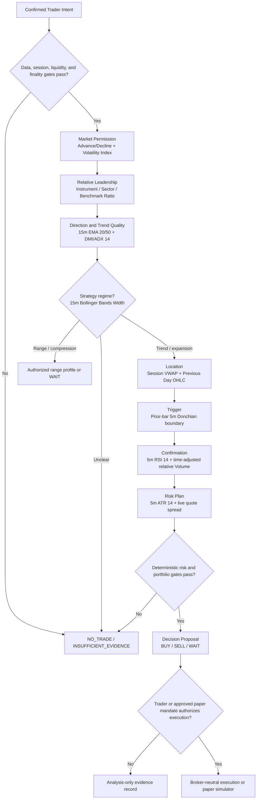

# PredictiveEdge Intraday Indicator Decision Profile v0.1

| Field | Value |
|---|---|
| Artifact type | CORE AI governed indicator and decision reference |
| Status | Proposed baseline for implementation, backtesting, and paper validation |
| Date | 2026-07-23 |
| Initial scope | Liquid NSE cash equities and indices; derivatives extensions are explicitly identified |
| Companion specification | [PEA-005 Market Intelligence and CORE AI Engine Specification v1.1](./PEA-005-Market-Intelligence-and-CORE-AI-Engine-Specification-v1.1.docx) |
| Source snapshot | [paper-trading/indicator.txt](../paper-trading/indicator.txt) |
| Source SHA-256 | `9B3FD192AE8912D291CB5B4CF4DBE60E637EC16429FF6D1623EE68C82818B696` |
| Extracted catalog | 110 `data-title` values; 110 unique values |

## 1. Architecture decision

The 110 available titles shall be maintained as a discovery catalog, not treated as 110 independent votes. Most are correlated variations of the same trend, momentum, volatility, channel, or volume concepts. Counting correlated indicators independently would create false confidence.

For the first intraday decision profile:

- **VWAP is the best single intraday reference** for session price location and fair-value context.
- **No single indicator is sufficient for a trade decision.**
- CORE AI shall use one primary feature from each independent decision dimension: market permission, direction, trend quality, regime, location, trigger, momentum, participation, and risk.
- Indicator evidence proposes a decision. Trader Intent, data quality, liquidity, portfolio, and deterministic risk controls remain mandatory gates.
- Conflicting, stale, unavailable, or insufficient evidence shall result in `WAIT`, `NO_TRADE`, or `INSUFFICIENT_EVIDENCE`, not a forced low-quality trade.

## 2. Recommended intraday baseline

### 2.1 Governed decision stack

| Decision layer | Exact catalog title | Initial calculation profile | Responsibility | Required input |
|---|---|---|---|---|
| Market participation | `Advance/Decline` | Finalized 5-minute market snapshot using the point-in-time eligible universe | Confirms whether the broader market supports the proposed direction; may veto or reduce confidence | Synchronized prices for a governed point-in-time constituent universe |
| Market stress | `Volatility Index` | Latest as-of 5-minute/15-minute observation and governed level/change percentile | Adds a market-risk overlay; may reduce size or require abstention | Separate India VIX series for the NSE profile |
| Relative leadership | `Ratio` | Instrument/sector and sector/benchmark ratio slope on finalized 15-minute bars; optional 60-minute confirmation | Prefers leaders for long candidates and laggards for short candidates | Synchronized, consistently adjusted second price series |
| Direction | `Moving Average Exponential` | EMA 20/50 on finalized 15-minute bars | Establishes higher-timeframe directional permission; never triggers an entry alone | OHLC |
| Trend quality | `Directional Movement` | DMI/ADX 14 on finalized 15-minute bars | Uses `+DI`, `-DI`, and ADX as one feature family to distinguish directional trend from weak/ranging conditions | OHLC |
| Strategy regime | `Bollinger Bands Width` | 20-period, 2-standard-deviation width on finalized 15-minute bars, interpreted through a rolling percentile | Distinguishes compression, normal volatility, and expansion so the correct strategy family can be selected | OHLC |
| Session structure | `Previous Day OHLC` | Prior official session high, low, and close, fixed for the current session | Supplies objective location, breakout, rejection, target, and invalidation levels | Final prior-session OHLC and exchange calendar |
| Intraday value | `VWAP` | Session-anchored VWAP built continuously from trades or 1-minute bars; consumed by decisions only at finalized 5-minute boundaries | Determines price location, reclaim/rejection state, and intraday directional bias | Trades for exact VWAP, or OHLCV for a documented bar-level approximation |
| Price trigger | `Donchian Channels` | Highest high/lowest low of the preceding 20 completed 5-minute bars; exclude the current signal bar | Defines an objective breakout or breakdown boundary | OHLC |
| Momentum timing | `Relative Strength Index` | RSI 14 on finalized 5-minute bars | Confirms momentum alignment or contradiction; use trend-consistent ranges and the 50 line, not blind 70/30 reversal rules | Close |
| Participation | `Volume` | Raw finalized 5-minute volume plus time-of-day relative volume against a historical median baseline | Confirms whether a break or rejection has meaningful participation | OHLCV and a historical intraday volume baseline |
| Risk distance | `Average True Range` | ATR 14 on finalized 5-minute bars, with 15-minute stability context and ATR as a percentage of price | Defines volatility-normalized stop distance, target feasibility, and position-size inputs; it does not determine direction | OHLC |

### 2.2 Optional session-map feature

`Central Pivot Range (CPR)` may be enabled for a strategy that explicitly uses pivot-day structure. It belongs to the same evidence family as `Previous Day OHLC` and `Pivot Points Standard`; it shall not be counted as an additional independent confirmation vote.

### 2.3 Mandatory non-indicator gates

The indicator stack does not replace:

- Trader Intent authorization, permitted direction, holding horizon, risk budget, and expiry.
- Exchange session state, halt/circuit state, and instrument eligibility.
- Data freshness, completeness, sequencing, candle finality, and warm-up readiness.
- Live bid/ask spread, quote age, depth or executable quantity where available.
- Event-risk restrictions.
- Portfolio exposure, daily-loss, drawdown, concentration, and kill-switch controls.

The catalog item `Spread` is ambiguous and shall not be used as a substitute for a live bid/ask spread. A broker-neutral L1 quote contract must supply executable spread evidence.

## 3. Timeframe and finality contract

| Resolution | CORE AI use | Decision rule |
|---|---|---|
| Tick/trade/L1 quote | Exact execution price, bid/ask spread, quote freshness, exact trade-level VWAP, and post-decision order triggering | May execute a previously approved conditional plan; cannot expose future bar information |
| 1 minute | Canonical base-bar aggregation, continuous session VWAP, volume accumulation, and provisional monitoring | Forming values are observable but cannot independently authorize a new recommendation |
| 5 minutes | Primary setup, trigger, momentum, participation, and risk decision timeframe | RSI, Donchian, relative volume, VWAP state, and ATR must use a finalized 5-minute candle |
| 15 minutes | Direction, trend quality, and volatility-regime context | EMA, DMI/ADX, Bollinger width, and ratio state must use a finalized 15-minute candle |
| 60 minutes | Optional higher-timeframe direction and relative-strength confirmation | Only the last completed 60-minute candle may be used |
| Prior daily session | Previous-day levels, optional CPR/pivots, daily volatility context | Values become usable only after the official prior session is complete and validated |

Every calculated feature shall carry:

```text
FeatureValue {
  featureId,
  value,
  unit,
  timeframe,
  observedFrom,
  observedTo,
  availableAt,
  isFinal,
  state: READY | WARMUP | STALE | UNAVAILABLE | INVALID,
  parameters,
  formulaVersion,
  inputManifestHash,
  evidenceRefs
}
```

Required causal rules:

1. A forming candle may publish a clearly marked `PROVISIONAL` monitoring value.
2. A provisional value shall not be substituted for a finalized decision feature.
3. A 15-minute value is unavailable until the 15-minute interval closes, even if its component 1-minute and 5-minute bars are available.
4. The Donchian trigger boundary excludes the current signal candle.
5. A decision produced from a completed candle may execute only on the next eligible market event; it cannot receive a same-candle historical fill.
6. Formula, seed, input, adjustment, calendar, and warm-up policies shall be identical in live, shadow, paper, replay, and backtest modes.

## 4. CORE AI execution flow



## 5. Decision semantics

The indicators are ordered evidence, not equal-weight votes.

| Layer | Question answered | It must not answer |
|---|---|---|
| Advance/Decline and Volatility Index | Does the market environment permit the setup? | Which exact instrument price should trigger entry? |
| Ratio | Is the instrument leading or lagging its relevant market context? | Is the setup safe to size? |
| EMA | What is the higher-timeframe direction? | Is the trend strong enough? |
| DMI/ADX | Is direction sufficiently persistent and which side dominates? | Where is fair value or the entry boundary? |
| Bollinger Bands Width | Is the market compressed, normal, or expanding? | Is price bullish or bearish by itself? |
| VWAP and prior-day levels | Where is price relative to session value and structure? | Does a breakout have participation? |
| Donchian | What completed-bar level defines the conditional trigger? | Is the broader environment supportive? |
| RSI and relative volume | Does momentum and participation confirm or contradict the trigger? | What stop distance is safe? |
| ATR | Is a volatility-normalized plan feasible? | What direction should be traded? |

### 5.1 Long-candidate outline

A long candidate may proceed only when the active strategy and Trader Intent permit buying and the governed profile finds:

1. Market and sector context do not veto long exposure.
2. The instrument shows positive relative leadership.
3. Finalized 15-minute EMA and DMI/ADX evidence supports an uptrend.
4. The active volatility regime permits the selected strategy.
5. Price is acceptably located relative to session VWAP and prior-session structure.
6. A completed-bar trigger or governed retest occurs.
7. Finalized 5-minute RSI and time-adjusted relative volume do not contradict the setup.
8. ATR, executable spread, target room, and portfolio constraints permit a valid risk plan.

The short outline reverses the directional and relative-strength conditions while retaining identical quality, finality, liquidity, and risk controls.

Thresholds are strategy parameters, not universal market truths. Candidate values such as ADX 20/25, RSI bands, volume multiples, EMA lengths, Donchian length, and ATR multiples must be walk-forward tested, regime-sliced, and approved through strategy governance before production use.

## 6. Strategy-specific optional profiles

| Authorized profile | Primary additions or substitutions | Guardrail |
|---|---|---|
| Trend pullback | Core EMA, DMI/ADX, VWAP, RSI, volume, and ATR stack | Do not add MACD or multiple moving-average variants as extra votes without ablation evidence |
| Breakout | Donchian Channels + Bollinger Bands Width + relative volume + ATR | Channel excludes the signal bar; low-volume breaks are rejected |
| Range/mean reversion | VWAP + `Bollinger Bands` + RSI while DMI/ADX confirms weak trend | Disabled when expansion/trend evidence invalidates the range regime |
| Pivot/session structure | CPR or `Pivot Points Standard` with Previous Day OHLC | Treat all pivot-derived levels as one evidence family |
| ATR trailing visualization | `SuperTrend` may visualize an ATR-derived trail | Trade Planner and Risk Intelligence own the stop; SuperTrend is not another confidence vote |
| Futures/options | `Open interest` and derivatives-specific volatility evidence | Requires a governed derivatives feed and point-in-time contract; not derivable from cash OHLCV |

## 7. Redundancy policy for the 110-title catalog

- **Moving-average family:** Arnaud Legoux, Double EMA, Hull, Least Squares, McGinley, Guppy, Triple EMA, VWMA, and the other MA variants are alternative smoothers. EMA is the initial baseline.
- **Momentum family:** Accelerator, Awesome, CCI, CMO, Connors RSI, Stochastic, Stochastic RSI, Williams %R, Ultimate Oscillator, TSI, TRIX, and Know Sure Thing substantially overlap. RSI is the initial baseline.
- **Trend-strength family:** Aroon, ADX, Directional Movement, Vortex, Trend Strength, Chop Zone, and Choppiness overlap. One shared DMI/ADX calculation is the initial baseline.
- **Band/channel family:** Bollinger Bands, Bollinger %B, Keltner, Envelopes, Standard Error Bands, Price Channel, and moving-average channels overlap. Bollinger width owns regime; Donchian owns the initial breakout boundary.
- **Trailing-stop family:** Parabolic SAR, SuperTrend, and Chande Kroll Stop overlap with ATR-based planning. They cannot independently multiply confidence.
- **Volume-flow family:** Accumulation/Distribution, CMF, Chaikin Oscillator, Klinger, MFI, OBV, PVT, Force Index, Ease of Movement, and Volume Oscillator are correlated transformations. Begin with raw and time-adjusted relative volume. Admit another flow feature only when ablation testing proves independent value.
- **Volatility family:** Historical Volatility, close-to-close, OHLC, zero-trend, Chaikin Volatility, and Standard Deviation overlap. ATR plus Bollinger width is sufficient for the initial profile.
- **Session-pivot family:** CPR, Pivot Points Standard, and Previous Day OHLC describe related prior-session structure and count as one evidence family.

## 8. Special data and causal handling

| Catalog title | Handling decision |
|---|---|
| `Advance/Decline` | Requires point-in-time universe membership and synchronized observations across many instruments. |
| `Correlation - Log`, `Correlation Coefficient`, `Ratio` | Require at least one synchronized comparison series with consistent corporate-action handling. |
| `Open interest` | Requires a futures/options feed; it is not present in cash-equity OHLCV. |
| `Volatility Index` | Use the externally published, timestamped India VIX series for the NSE profile unless a separately governed option-chain model is implemented. |
| `Spread` | Define explicitly as a two-series analytical spread if used. It is not the executable bid/ask spread. |
| `Volume Profile Fixed Range` | Reproducible price-at-volume allocation needs explicit range boundaries and sufficiently granular trade or lower-timeframe data. |
| `Volume Profile Visible Range` | Exclude from automated decisions because the result depends on a user-interface viewport and is not a stable reproducible feature. |
| `VWAP` | Trade prints provide exact session VWAP. OHLCV produces a documented bar-level approximation. |
| `Williams Fractal` | The pivot is usable only after the required later confirmation bars; `availableAt` must reflect that delay. |
| `Zig Zag` | Exclude from live decision evidence because its latest leg can be revised. It may be used for retrospective labeling when clearly separated from causal features. |
| `Detrended Price Oscillator` | Exclude until its displacement/alignment implementation passes causality tests. |

## 9. Implementation requirements

1. Broker and data-provider adapters shall supply raw, timestamped market facts, not authoritative decision indicators.
2. PredictiveEdge shall calculate, version, test, and persist its governed features internally.
3. Every formula shall define source fields, smoothing method, parameters, session reset behavior, warm-up, missing-data behavior, precision, corporate-action policy, and finality.
4. Indicator values displayed by a chart UI may be used for visual parity testing but shall not be the runtime source of truth.
5. Golden-vector tests shall compare the implementation against independently calculated examples and an approved reference implementation.
6. The feature engine shall produce identical finalized outputs from the same input manifest in live capture replay, paper trading, and backtesting.
7. Trader Intent shall select an approved strategy/profile; it shall not dynamically assemble arbitrary indicator combinations.
8. Model and rule outputs shall provide supporting evidence, contradicting evidence, readiness, and abstention reasons.
9. Strategy validation shall include walk-forward testing, cost/slippage sensitivity, regime slices, parameter perturbation, feature ablation, and paper/shadow observation.
10. No parameter or feature shall be promoted solely because it improves in-sample profit.

## 10. Acceptance criteria

- All 110 source `data-title` values are retained exactly in Appendix A.
- The extraction count and source hash are reproducible.
- Each enabled decision feature has a registered formula version, parameter set, warm-up policy, and data dependency.
- No provisional higher-timeframe value is presented as final.
- No current candle contributes to a prior-bar breakout boundary.
- No completed-candle decision receives a historical same-candle fill.
- Missing market breadth, VIX, comparison-series, volume, or quote data is explicit; it is never silently replaced.
- One feature family cannot contribute multiple correlated confidence votes unless an approved ablation study demonstrates independent value.
- `NO_TRADE` and `INSUFFICIENT_EVIDENCE` are first-class, explainable outcomes.
- Risk Intelligence can reject any indicator-supported decision.

## Appendix A: complete source catalog

The following values were extracted from the `data-title` attributes in the source snapshot, in source order:

1. Accelerator Oscillator
2. 52 Week High/Low
3. Accumulation/Distribution
4. Accumulative Swing Index
5. Advance/Decline
6. Arnaud Legoux Moving Average
7. Aroon
8. Average Directional Index
9. Average Price
10. Average True Range
11. Awesome Oscillator
12. Balance of Power
13. Bollinger Bands
14. Bollinger Bands %B
15. Bollinger Bands Width
16. Central Pivot Range (CPR)
17. Chaikin Money Flow
18. Chaikin Oscillator
19. Chaikin Volatility
20. Chande Kroll Stop
21. Chande Momentum Oscillator
22. Chop Zone
23. Choppiness Index
24. Commodity Channel Index
25. Connors RSI
26. Coppock Curve
27. Correlation - Log
28. Correlation Coefficient
29. Detrended Price Oscillator
30. Directional Movement
31. Donchian Channels
32. Double EMA
33. Ease Of Movement
34. Elder's Force Index
35. EMA Cross
36. Envelopes
37. Fisher Transform
38. Guppy Multiple Moving Average
39. Historical Volatility
40. Hull Moving Average
41. Ichimoku Cloud
42. Keltner Channels
43. Klinger Oscillator
44. Know Sure Thing
45. Least Squares Moving Average
46. Linear Regression Curve
47. Linear Regression Slope
48. MA Cross
49. MA with EMA Cross
50. MACD
51. Majority Rule
52. Mass Index
53. McGinley Dynamic
54. Median Price
55. Momentum
56. Money Flow Index
57. Moving Average
58. Moving Average Adaptive
59. Moving Average Channel
60. Moving Average Double
61. Moving Average Exponential
62. Moving Average Hamming
63. Moving Average Multiple
64. Moving Average Triple
65. Moving Average Weighted
66. Net Volume
67. On Balance Volume
68. Open interest
69. Parabolic SAR
70. Pivot Points Standard
71. Previous Day OHLC
72. Price Channel
73. Price Oscillator
74. Price Volume Trend
75. Rank Correlation Index
76. Rate Of Change
77. Ratio
78. Relative Strength Index
79. Relative Vigor Index
80. Relative Volatility Index
81. SMI Ergodic Indicator/Oscillator
82. Smoothed Moving Average
83. Spread
84. Standard Deviation
85. Standard Error
86. Standard Error Bands
87. Stochastic
88. Stochastic RSI
89. SuperTrend
90. Trend Strength Index
91. Triple EMA
92. TRIX
93. True Strength Index
94. Typical Price
95. Ultimate Oscillator
96. Volatility Close-to-Close
97. Volatility Index
98. Volatility O-H-L-C
99. Volatility Zero Trend Close-to-Close
100. Volume
101. Volume Oscillator
102. Volume Profile Fixed Range
103. Volume Profile Visible Range
104. Vortex Indicator
105. VWAP
106. VWMA
107. Williams %R
108. Williams Alligator
109. Williams Fractal
110. Zig Zag

## References

- [PredictiveEdge Constitution v1.0](../PredictiveEdge-Constitution-v1.0.md)
- [ADR-0002: Zerodha Data, Paper Trading, and Backtesting Before Live Trading](../ADR-0002-zerodha-paper-backtest-priority.md)
- [ADR-0003: Kafka Event Backbone and Trade Guardian Point-in-Time Monitoring](../ADR-0003-kafka-event-backbone-trade-guardian.md)
- [TradingView: Volume Weighted Average Price (VWAP)](https://www.tradingview.com/support/solutions/43000502018-volume-weighted-average-price-vwap/)
- [TradingView: Exponential Moving Average](https://www.tradingview.com/support/solutions/43000592270-exponential-moving-average/)
- [TradingView: Average Directional Index (ADX)](https://www.tradingview.com/support/solutions/43000589099-average-directional-index-adx/)
- [TradingView: Average True Range (ATR)](https://www.tradingview.com/support/solutions/43000501823-average-true-range-atr/)
- [TradingView: Relative Strength Index (RSI)](https://www.tradingview.com/support/solutions/43000502338-relative-strength-index-rsi/)
- [TradingView: Volume](https://www.tradingview.com/support/solutions/43000591617-volume/)
- [Zerodha Varsity: ADX, SuperTrend, ATR, and VWAP](https://zerodha.com/varsity/chapter/supplementary-notes-1/)

## Usage note

This profile is an engineering and research baseline, not a promise of profitability or a standalone trading recommendation. It must be validated with point-in-time data, realistic costs, slippage, liquidity constraints, walk-forward tests, paper trading, and human-governed promotion before any production decision use.
