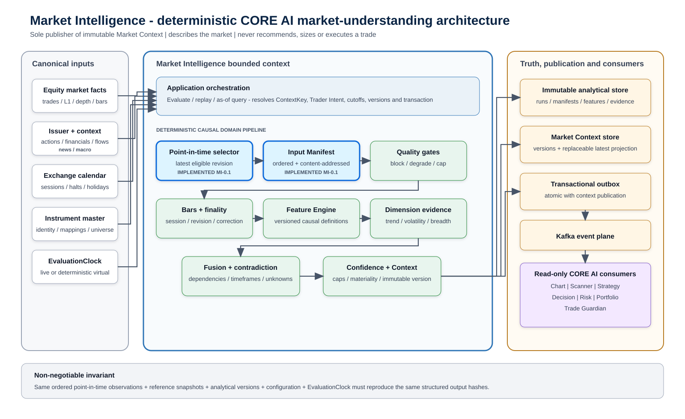
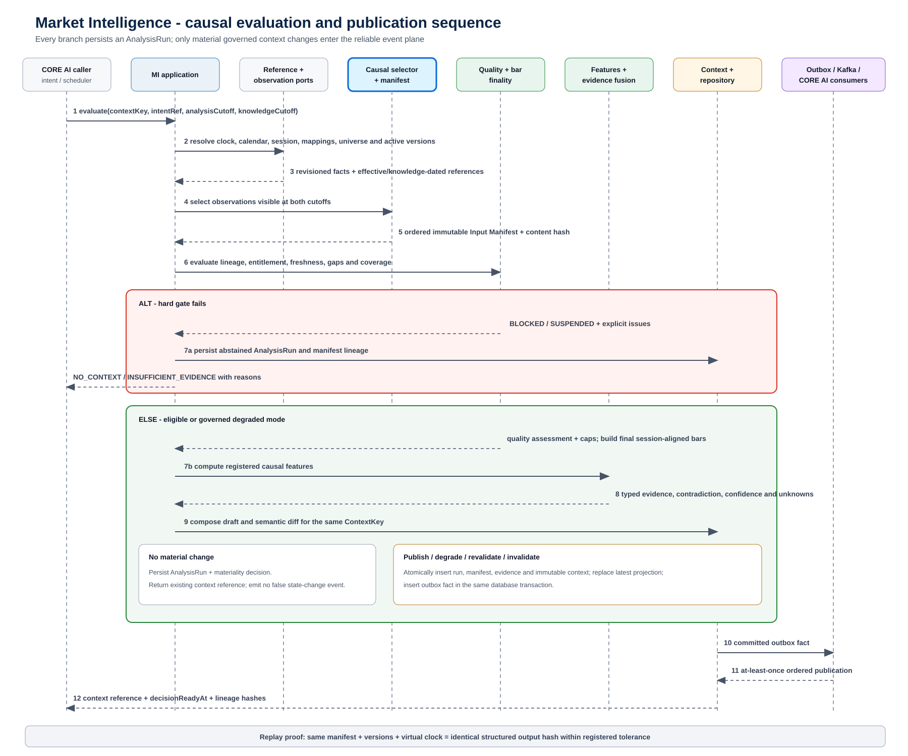

# PredictiveEdge Market Intelligence Developer Architecture v0.1

| Field | Value |
|---|---|
| Artifact | Detailed developer architecture and implementation reference |
| Status | Proposed baseline for incremental implementation |
| Scope | NSE cash-equity Market Intelligence across market, microstructure, issuer and contextual data |
| Architecture style | Modular monolith with enforced bounded-context boundaries |
| Authority | Market understanding only; no recommendation, sizing, or execution authority |
| Primary specification | PEA-005 Market Intelligence and CORE AI Engine Specification v1.1 |
| Current implementation | Phase 0 causal observation selection and point-in-time manifest |
| Version | 0.1 |

## 1. Purpose and architecture decision

Market Intelligence is the authoritative market-understanding capability of PredictiveEdge. It continuously transforms timestamped market facts and governed reference data into immutable, versioned and explainable `MarketContext` business objects. Chart, Scanner, Strategy, Decision, Risk, Portfolio and Trade Guardian consume those contexts rather than independently interpreting raw market data.

This design treats Market Intelligence as part of the CORE AI Intelligence heart, not as an integration or reporting peripheral. The first engineering priority is causal correctness: the engine must prove exactly which facts were available, when they became usable, which revisions were selected and which analytical versions transformed them. Indicator breadth and model sophistication follow only after these invariants are enforced.

The defining authority boundary is:

> Market Intelligence describes the governed market environment. It does not recommend a trade, size a position, manage a portfolio, place an order, or connect directly to a broker execution transport.

## 2. Goals and non-goals

### 2.1 Goals

- Publish one authoritative `MarketContext` stream for each complete `ContextKey`.
- Produce identical finalized structured outputs from the same ordered point-in-time inputs, versions, configuration and evaluation clock.
- Preserve event time, knowledge time, corrections, finality, data quality and lineage as first-class domain semantics.
- Make `UNKNOWN`, `INSUFFICIENT_EVIDENCE`, `CONFLICT_UNRESOLVED`, `DEGRADED` and `SUSPENDED` explicit outcomes.
- Build explainability from structured evidence, opposition, uncertainty, quality and version references.
- Support live analysis and exact replay through the same domain path, differing only through ports and clocks.
- Provide a stable business contract for downstream CORE AI capabilities and Trade Guardian.
- Cover the complete cash-equity information surface required for market understanding, rather than treating OHLCV as the whole equity market.

### 2.2 Non-goals

- Autonomous live trading or broker-order authority.
- Trade recommendation, entry selection, position sizing or order tactics.
- Using an LLM to calculate authoritative prices, indicators, confidence gates, risk or fills.
- Treating provider indicators or chart UI values as the runtime source of truth.
- Reconstructing tick order, quotes, queue position or intrabar paths that are absent from the source dataset.
- Allowing corrections or governance actions to rewrite previously published contexts.

### 2.3 Equity MVP coverage commitment

“Equity MVP” means full cash-equity market understanding for the selected NSE universe. It does not mean price candles alone. The canonical observation model and source ports must accommodate every information family below even when individual feeds are enabled incrementally.

| Equity information family | MVP canonical coverage | Examples |
|---|---|---|
| Trades and quotes | Required | Trades, L1 bid/ask, quote age and executable spread |
| Market depth | Contract-ready; source tier may vary | Order-book snapshots, deltas, sequence gaps and rebuilds |
| Bars and reference series | Required | 1m/5m/15m/60m bars, indices, India VIX and governed comparison series |
| Venue and instrument state | Required | Session phase, auction, halt, circuit, suspension and trading eligibility |
| Universe and classification | Required | Point-in-time index constituents, sectors, industries and eligibility |
| Corporate actions | Required | Dividend, split, bonus, rights, buyback, merger/demerger, symbol change and delisting |
| Corporate disclosures | Required | Exchange announcements, board meetings, material disclosures and governance events |
| Financial and earnings facts | Required for equity context | Results, financial statements, earnings releases and revisions |
| Ownership and institutional activity | Required for governed profiles that use it | Shareholding snapshots, FII/DII flows, bulk/block deals, delivery statistics, short selling and securities lending |
| News and macro context | Required with explicit availability | Issuer news, market news, policy decisions, macro releases, rates, FX and commodities used as context |

Derivative-chain analytics and order execution are not part of the cash-equity MVP authority. They may be added later through new versioned schemas without changing the equity observation families or causal selection model.

## 3. Bounded-context ownership

| Concern | Market Intelligence owns | Owned elsewhere |
|---|---|---|
| Market state | Market, benchmark and sector regime, trend, volatility, liquidity, breadth and leadership | Instrument trade decision |
| Chart structure | Market/index/sector structure evidence where required for context | Instrument support, resistance, gaps, swings and patterns belong to Chart Intelligence |
| Features | Governed causal definitions used for market understanding | Strategy choice and recommendation logic |
| Confidence | Market-context confidence, dimensions, caps and unknowns | Recommendation confidence and risk acceptance |
| Publication | Immutable `MarketContext`, materiality decision and domain events | Order, position and broker lifecycle events |
| Monitoring support | Later contexts and evidence deltas | Trade Guardian owns thesis-health evaluation and advisory alerts |
| Execution | None | Human trader; no PredictiveEdge live execution gateway in the current product boundary |

Market Intelligence is the sole publisher of `MarketContext` for a `ContextKey`. Consumers may reference a context, freeze it inside a decision bundle and compare later versions, but they cannot modify it.

## 4. Component architecture



Editable diagram source: [market-intelligence-component-architecture-v0.1.mmd](./diagrams/market-intelligence-component-architecture-v0.1.mmd)

The architecture separates five responsibilities:

1. Adapters translate licensed provider data into canonical observations and effective/knowledge-dated reference snapshots.
2. Application orchestration resolves the run scope, cutoffs, clock, active versions and transactional boundary.
3. The domain performs deterministic selection, quality evaluation, bar finality, feature calculation, evidence fusion, confidence and materiality.
4. Persistence stores every analysis run and immutable analytical artifact; context publication uses a transactional outbox.
5. Downstream capabilities consume governed context contracts and never reach through the boundary to reinterpret provider payloads.

The blue-highlighted selector and input manifest in the diagram represent the Phase 0 causal kernel already implemented in `market-intelligence-domain`.

## 5. Core domain language

### 5.1 ContextKey

`ContextKey` identifies one governed interpretation stream:

```text
ContextKey {
  scopeType,
  scopeId,
  venue,
  assetClass,
  currency,
  decisionHorizon,
  sessionId,
  contextPolicyVersion
}
```

There is no ambiguous platform-wide “latest context.” A latest query is valid only for a complete key in live mode. Replay and historical queries always provide both market-time and knowledge-time cutoffs.

### 5.2 EvaluationCutoff

```text
EvaluationCutoff {
  analysisCutoff,   // latest market occurrence allowed
  knowledgeCutoff   // latest fact usability/revision knowledge allowed
}
```

`analysisCutoff` answers “what market period are we evaluating?” while `knowledgeCutoff` answers “what could the platform legitimately know?” Keeping them separate prevents corrected history, late news, revised constituents and delayed source publications from leaking into earlier decisions.

### 5.3 Observation descriptor and subject

Context scope and observation subject are intentionally separate. A Market Context is published only at `MARKET`, `INDEX`, `SECTOR` or `INSTRUMENT` scope. Its inputs can describe a venue, universe, industry, issuer, economy or macro series without pretending that each input subject is itself a context stream.

```text
ObservationDescriptor {
  kind,       // stable coarse information family
  schemaId    // provider-neutral versioned payload contract
}

ObservationSubject {
  type: VENUE | MARKET | UNIVERSE | INDEX | SECTOR | INDUSTRY |
        ISSUER | INSTRUMENT | ECONOMY | MACRO_SERIES,
  id
}
```

The equity-complete `ObservationKind` vocabulary is:

| Group | Observation kinds |
|---|---|
| Market microstructure | `TRADE`, `L1_QUOTE`, `ORDER_BOOK_SNAPSHOT`, `ORDER_BOOK_DELTA` |
| Time series and state | `BAR`, `SERIES_VALUE`, `MARKET_STATUS`, `INSTRUMENT_STATUS` |
| Point-in-time membership | `UNIVERSE_MEMBERSHIP` |
| Issuer lifecycle | `CORPORATE_ACTION`, `CORPORATE_ANNOUNCEMENT` |
| Financial information | `FINANCIAL_STATEMENT`, `EARNINGS_RELEASE` |
| Ownership and flows | `OWNERSHIP_SNAPSHOT`, `INSTITUTIONAL_FLOW` |
| Exchange-reported activity | `BULK_DEAL`, `BLOCK_DEAL`, `DELIVERY_STATISTICS`, `SHORT_SELLING_ACTIVITY`, `SECURITIES_LENDING_ACTIVITY` |
| External context | `NEWS_EVENT`, `MACRO_RELEASE` |

Detailed semantics are versioned schemas such as `market.bar.v1`, `market.quote.l1.v1`, `equity.corporate-action.v1` or `equity.financial-statement.v1`. Corporate-action subtypes such as dividend, split, bonus, rights, buyback, merger and delisting belong inside the applicable schema; they are not independent top-level observation kinds.

### 5.4 CanonicalObservationRevision

Every observation revision carries stable canonical identity, revision number, descriptor, subject, source identity, `eventTime`, optional `sourcePublishedAt`, `receivedAt`, `usableAt` and raw-payload content hash. The domain never receives provider SDK classes or broker tokens as authoritative identity.

Selection uses the latest revision satisfying both conditions:

```text
eventTime <= analysisCutoff
usableAt  <= knowledgeCutoff
```

Appending a future event or a correction first known after the cutoff must not change an earlier manifest or output hash.

### 5.5 PointInTimeInputManifest

The manifest is the ordered, content-addressed evidence boundary for one run. It freezes exact observation revisions and both cutoffs. Later stages reference the manifest hash rather than an unstable query such as “all bars up to time T.”

Canonical ordering, locale-independent normalization and length-prefixed hashing are domain invariants. A supplied hash that does not match the manifest contents is rejected.

### 5.6 AnalysisRun

Every evaluation creates an immutable `AnalysisRun`, including blocked, abstained, degraded, no-change and failed runs. A run records:

- context key and Trader Intent reference;
- analysis and knowledge cutoffs;
- input manifest hash;
- calendar, instrument master, universe and source-policy versions;
- feature, rule, model and context-policy versions;
- quality outcome and blocking issues;
- output references and content hashes;
- start, completion and `decisionReadyAt` semantics;
- mode: live, replay, shadow or research reconstruction.

## 6. Evaluation sequence



Editable diagram source: [market-intelligence-evaluation-sequence-v0.1.mmd](./diagrams/market-intelligence-evaluation-sequence-v0.1.mmd)

### 6.1 Evaluation steps

1. Resolve an active immutable Trader Intent reference and complete `ContextKey`.
2. Capture the `EvaluationCutoff` through an injected live or virtual `EvaluationClock`.
3. Resolve the exchange calendar, session, instrument mapping, universe, entitlements and analytical versions as known at the cutoffs.
4. Query revisioned canonical observations through `ObservationQueryPort`.
5. Select the latest eligible revision for each observation identity and build the deterministic input manifest.
6. Apply hard quality, lineage, entitlement, session and coverage gates.
7. Build or load session-aligned final bars without exposing an incomplete higher timeframe.
8. Calculate registered feature definitions and readiness states.
9. Produce typed evidence for market dimensions, preserving support, opposition, unknowns and uncertainty.
10. Fuse compatible evidence without double-counting shared sources or correlated feature families.
11. Calculate decomposed context confidence and any mandatory caps.
12. Compose a draft context and semantic diff from the prior version for the same key.
13. Persist the `AnalysisRun` regardless of whether publication occurs.
14. When materiality permits publication, atomically store the immutable context, update the replaceable latest projection and insert the outbox event.
15. Publish at least once; consumers use event ID and aggregate version for idempotency.

## 7. Time, session and finality model

### 7.1 Required time fields

| Field | Meaning | Rule |
|---|---|---|
| `eventTime` | When the market or business fact occurred | Must be within `analysisCutoff` |
| `sourcePublishedAt` | When the source published the fact, if supplied | Preserved for lineage |
| `receivedAt` | When PredictiveEdge received the fact | Cannot precede event occurrence under the canonical policy |
| `usableAt` | Earliest time the fact passed ingestion validation and could be used | Must be within `knowledgeCutoff` |
| `observedThrough` | Latest market event represented by an analytical output | Carried by bars, features, evidence and context |
| `decisionReadyAt` | Earliest deterministic time the completed analytical output can be acted upon | Includes finality and processing semantics |
| `publishedAt` | When a durable context event was published | Operational time, not market truth |

Domain code receives an `EvaluationClock`; it never reads the system wall clock directly.

### 7.2 MarketBar finality

A canonical `MarketBar` represents a bounded exchange-session interval and a revisioned aggregation result. Planned minimum fields are:

```text
MarketBar {
  barId, revision, instrumentId, venue, sessionId,
  timeframe, intervalStart, intervalEnd,
  open, high, low, close, volume, openInterest?,
  observedThrough, finalityState, finalizedAt,
  correctionReason?, calendarVersion,
  aggregationPolicyVersion, inputManifestHash
}
```

Finality states are `PROVISIONAL`, `FINAL`, `CORRECTED` and `INVALID`. The default decision policy is `FINAL_ONLY`. Provisional values may support monitoring-only views but cannot authorize a new recommendation.

Bars align to exchange sessions, auctions, halts and special sessions rather than generic epoch boundaries. A 09:15-09:20 five-minute bar becomes eligible only after the interval closes and the watermark/finality policy completes. At 10:17, a fifteen-minute context may use data through 10:15, not the forming 10:15-10:30 interval.

## 8. Data quality and degraded modes

Quality is both a hard gate and analytical evidence. A critical invalid condition cannot disappear inside a high composite score.

| Condition | Required behavior |
|---|---|
| Duplicate delivery | Suppress idempotently while retaining lineage |
| Out-of-order within lateness budget | Reorder before bar finality |
| Arrival after finality budget | Create a correction revision and affected-context reassessment |
| Mandatory source missing | Block or degrade according to versioned policy |
| Primary/alternate conflict | Preserve both claims and explicit precedence impact |
| Coverage loss | Publish numerator, expected denominator, exclusions and reasons |
| Stale fallback | Label original cutoff and reason; never call it current |
| Source recovery | Create new evidence and possible context version; never edit history |
| Invalid entitlement, lineage or session identity | Fail closed |

Missing evidence is `UNKNOWN`, never zero or neutral. Quality outcomes carry dimension scores, blocking issues, confidence caps and affected evidence references.

## 9. Feature engine architecture

The Feature Engine is a deterministic shared kernel used by Market Intelligence and reused through governed contracts by Chart and Scanner. A feature is a causal, versioned transformation rather than a numeric database column.

```text
FeatureValue {
  featureId,
  definitionRef,
  scope,
  timeframe,
  value,
  unit,
  valueTime,
  observedFrom,
  observedThrough,
  availableAt,
  finality,
  readiness: READY | WARMING_UP | STALE | UNAVAILABLE | INVALID,
  parameters,
  formulaVersion,
  codeOrModelVersion,
  inputManifestHash,
  evidenceRefs
}
```

Each registered definition states formula, inputs, units, parameters, precision, rounding boundary, initialization, warm-up, null and stale behavior, session reset, corporate-action policy, causal delay and numeric tolerance.

The first governed feature set follows independent decision dimensions rather than counting correlated indicators as separate votes:

| Dimension | Initial features | Principal guardrail |
|---|---|---|
| Direction | EMA 20/50 on final 15-minute bars | Direction is not trend strength or entry timing |
| Trend quality | DMI/ADX 14 on final 15-minute bars | `+DI`, `-DI` and ADX are one feature family |
| Regime | Bollinger Band Width on final 15-minute bars | Width is not direction |
| Intraday location | Session VWAP plus prior-session OHLC | Bar-derived VWAP must be labelled approximate |
| Trigger | Prior-bar Donchian boundary on final 5-minute bars | Current signal bar is excluded |
| Momentum | RSI 14 on final 5-minute bars | Warming up is not zero |
| Participation | Final volume and time-adjusted relative volume | Uses same-session-minute baseline |
| Risk distance input | ATR 14 on final 5-minute bars | ATR informs feasibility; Risk owns approval and size |
| Market permission | Advance/decline and India VIX context | Missing breadth or VIX remains explicit |
| Relative leadership | Instrument/sector/benchmark ratio | Series must be synchronized and consistently adjusted |

## 10. Evidence, fusion and confidence

Evidence is a typed claim with scope, horizon, direction, strength, uncertainty, effective/detected/expiry times, source features, observations, quality and rule/model version.

Fusion evaluates compatibility and dependency before combining evidence. Two claims derived from the same source or correlated feature family cannot multiply confidence. Conflicting timeframes remain visible: a bullish five-minute condition within a bearish daily condition becomes `MIXED` or `CONFLICT_UNRESOLVED`, not numerical noise.

Market-context confidence contains:

- dimension-level confidence;
- support and opposition;
- data quality and coverage;
- uncertainty and unknowns;
- conflict score;
- mandatory caps and their reasons;
- calibration reference when probabilistic states are used;
- compatibility score and display band.

The 0-100 compatibility view is not a probability of profitable trade. Market-context confidence is distinct from recommendation confidence, expected return and risk.

## 11. MarketContext contract

The detailed schema will be versioned in `market-intelligence-contracts`. Minimum conceptual groups are:

| Group | Required content |
|---|---|
| Identity | context ID, version, complete context key, schema version |
| Time | analysis cutoff, knowledge cutoff, observed through, decision ready, expiry |
| Lineage | manifest, calendar, instrument master, universe, source, feature, rule and model versions |
| State | primary regime plus transition, alternative or overlay states |
| Dimensions | trend, volatility, liquidity, breadth, sector, structure and event assessments |
| Evidence | leading, opposing, missing, degraded and contradictory evidence references |
| Confidence | dimensions, compatibility score/band, caps, conflicts, unknowns and calibration |
| Quality | status, coverage, issues, exclusions, freshness and fallback use |
| Explanation | structured facts, semantic change and expected reevaluation trigger |
| Integrity | content hash, input-manifest hash and authoritative/replay designation |

Published payloads are append-only. Supersession, expiry, correction and invalidation are relations or new versions. “Latest” is a replaceable projection, never the source of truth.

## 12. Module and dependency architecture

| Maven module | Responsibility | Allowed dependency direction |
|---|---|---|
| `market-intelligence-contracts` | Public API/event schemas and vocabulary | Foundation contracts only |
| `market-intelligence-domain` | Equity observation taxonomy, causality, bars, quality, features, evidence, regime, confidence, context and materiality | Contracts/domain foundation; no Spring or provider SDKs |
| `market-intelligence-application` | Evaluate, query and replay use cases; clocks, transactions and ports | Domain |
| `market-intelligence-infrastructure` | Observation adapters, persistence, outbox, cache and feature execution adapters | Application ports |
| `market-intelligence-api` | Authenticated REST/event endpoints and DTO validation | Application and contracts |
| `market-intelligence-testkit` | Virtual clocks, fixtures, golden vectors and parity/property tests | Test scope only |

Initial deployment remains a modular monolith. Service extraction is justified only by measured ingestion load, compute isolation, deployment cadence, failure isolation or security boundaries.

### 12.1 Mandatory code boundaries

- Domain modules have no Spring Web, broker SDK, provider payload, wall-clock or AI-provider dependency.
- Broker adapters supply raw facts; they do not define canonical bars or authoritative indicators.
- Infrastructure implements ports and cannot leak provider identity into domain contracts.
- Downstream contexts reference `MarketContext`; they do not modify or republish it.
- Persistence tables are owned by the bounded context and are not shared mutable integration surfaces.

## 13. Application ports

| Port | Direction | Responsibility |
|---|---|---|
| `ObservationQueryPort` | Inbound data dependency | Point-in-time revision queries and manifests without provider objects |
| `CalendarPort` | Inbound reference dependency | Effective/knowledge-dated sessions, auctions, halts and holidays |
| `InstrumentMasterPort` | Inbound reference dependency | Canonical instruments, mappings, tick sizes and point-in-time universe |
| `FeatureEnginePort` | Shared kernel boundary | Registered causal definitions and snapshots |
| `ContextRepository` | Outbound persistence | Immutable context store and bitemporal/as-of query |
| `EvidenceRepository` | Outbound persistence | Features, evidence, assessments and lineage |
| `ContextPublicationPort` | Outbound messaging | Transactional outbox and ordered publication |
| `EvaluationClock` | Inbound time | Live or virtual deterministic time |
| `GovernanceRegistryPort` | Both | Signed active versions, approvals, suspension and rollback |
| `AuditPort` | Outbound audit | Immutable security, policy and privileged-action facts |

## 14. Persistence and eventing

Planned relational concepts include `mi_analysis_run`, `mi_input_manifest`, `mi_observation_revision`, `mi_quality_assessment`, `mi_quality_issue`, `mi_feature_definition`, `mi_feature_value`, `mi_evidence`, `mi_dimension_assessment`, `mi_confidence_assessment`, `mi_market_context`, `mi_context_component`, `mi_context_evidence_link`, `mi_context_relation`, `mi_material_change_decision`, `mi_publication`, `mi_outbox`, `mi_consumer_checkpoint` and `mi_governance_action`.

Context, latest projection and outbox insert commit in one database transaction. Kafka delivery is at least once. Consumers deduplicate by event ID and aggregate version and preserve ordering per context key.

Initial durable event facts include:

- `MarketContext.Published`, `Superseded`, `Degraded`, `Invalidated` and `Revalidated`;
- `Regime.Changed`, `VolatilityState.Changed`, `LiquidityState.Changed` and `BreadthState.Changed`;
- `SectorLeadership.Changed` and `EventRisk.Changed`;
- `ConfidenceBand.Changed`;
- `ObservationCoverage.Degraded` and `ObservationCoverage.Restored`;
- `MarketAssessment.Suspended` and `MarketAssessment.Resumed`.

## 15. Materiality and publication policy

Every run compares its draft with the latest context for the same key. A new version is considered when there is a primary/overlay state transition, material probability or trend/volatility/liquidity/breadth band change, new critical contradiction, confidence/quality band change, high-impact event, expiry, periodic revalidation, correction, post-halt rebuild or governed reassessment.

Hysteresis, minimum dwell, coalescing and cooldown reduce flapping. Critical halt, severe quality failure and extreme-risk states bypass cooldown. A refresh may publish with semantic diff `NONE` when its manifest or cutoff changed; it must not falsely report a regime transition.

## 16. Security and governance

- Enforce source entitlement and derived-data classification at ingestion, persistence, export and explanation.
- Separate tenant/user intents, experiments and decision bundles.
- Sign and version schemas, features, rules and models.
- Prevent application identities from updating or deleting published contexts.
- Keep untrusted text outside the atomic deterministic publication path.
- Treat retrieved text as data, never as tool or policy instructions.
- Record AI provider/model/prompt and exact transmitted fields when an AI renderer is permitted.
- Keep narrative generation non-blocking; structured context remains authoritative.
- Provide assessment suspension, artifact quarantine, rollback and kill-switch operations with immutable reasons and approval.

## 17. Observability and service objectives

Measure each latency segment independently: source-to-receive, receive-to-usable, usable-to-feature, feature-to-assessment, assessment-to-publication and publication-to-consumer acknowledgment.

Required metrics include freshness, expected/received observations, gaps, duplicates, corrections, universe coverage, source disagreement, feature readiness and lag, context age and churn, degraded duration, confidence/abstention distribution, transition frequency, replay mismatch, outbox lag and consumer checkpoint age.

The deterministic decision path targets three seconds p95 for the configured five-minute MVP universe. Narrative generation never blocks structured publication.

## 18. Verification strategy

### 18.1 Phase 0 causal invariants

| Test | Stimulus | Expected proof |
|---|---|---|
| Availability | `eventTime` before cutoff but `usableAt` after cutoff | Fact is absent |
| Future append invariance | Append observations after either cutoff | Earlier manifest and output hashes are unchanged |
| Correction | Add a later revision | Earlier `AS_KNOWN` run retains the prior revision |
| Collection order | Shuffle eligible observations | Manifest ordering and hash are identical |
| Partial bar | Evaluate before five/fifteen-minute finality | Final-only output cannot see the bar |
| Universe revision | Apply later constituent change | Earlier membership remains exactly as known/effective |
| Clock parity | Repeat with fixed virtual clock | Identical output hash |

The current `market-intelligence-domain` increment implements and tests the equity-complete observation taxonomy, context/subject separation, versioned schema identity, availability, revision identity, correction history, deterministic ordering, hash integrity and future-append invariance.

### 18.2 Feature and context verification

- Golden feature vectors and registered numeric tolerances.
- Batch-versus-stream equality from the same manifest.
- Captured-live replay to identical context hashes.
- Duplicate, out-of-order, late and corrected event property tests.
- Fixed locale, timezone, clock, seed and deterministic tie breaking.
- Missing-data, warm-up, stale, halt and special-session scenarios.
- Feature-family dependency and confidence double-counting tests.
- Explanation faithfulness against structured evidence.
- Outbox retry, consumer replay, cache loss and database-restore recovery.

## 19. Incremental delivery sequence

| Increment | Deliverable | Unit-test gate |
|---|---|---|
| MI-0.1 - Equity causal observations | Equity-complete kinds/subjects, versioned schemas, dual cutoffs, immutable revisions, selector and manifest hash | Taxonomy, availability, correction and future invariance |
| MI-0.2 - Calendar and MarketBar | Session identity, interval alignment, finality and correction revision | Partial-bar, special-session and correction tests |
| MI-0.3 - Feature registry | Definition metadata, readiness and deterministic feature values | Golden vectors, warm-up and future invariance |
| MI-0.4 - Quality engine | Blocking issues, coverage, degraded policy and caps | No averaging-away, missing-as-unknown |
| MI-1.0 - Deterministic context | Trend/volatility/volume evidence, fusion, confidence and context hash | Live/replay parity for captured session |
| MI-1.1 - Publication | Immutable context store, latest projection and outbox | Atomicity, retry and idempotency |
| MI-2.0 - Breadth and sector | Point-in-time universe, breadth and sector leadership | No survivorship or denominator leakage |
| MI-2.1 - Multi-timeframe | Final 5m/15m/60m fusion and contradiction | No partial higher-timeframe leakage |
| MI-3.0 - Contextual events | News, corporate, macro and institutional evidence | First-seen, revision, retraction and rights preservation |

MI-0.2 now supplies the NSE-aware session boundary, canonical `MarketBar` finality model and point-in-time correction selection. The next implementation increment is MI-0.3: the deterministic feature registry. Feature calculations must declare their inputs, readiness, warm-up, version and numeric policy before indicator implementations begin.

## 20. First executable vertical slice

The first end-to-end proof uses finalized five-minute RELIANCE and NIFTY observations, completed fifteen-minute and optional one-hour references, an input manifest, deterministic quality and features, immutable Market Context, a RELIANCE Chart Context, Trader Intent and decision bundle, a recommendation-only `SELL`, `WAIT` or `NO_TRADE` proposal, independent risk review, Trade Guardian monitoring and exact replay hashes.

The current product does not place the live order. The trader may manually act outside PredictiveEdge; Trade Guardian then monitors the manually registered trade against later governed contexts.

## 21. Acceptance criteria

- Every context proves what information was available and when it became usable.
- The canonical input model covers cash-equity market data, depth, sessions, membership, issuer actions/disclosures, financials, ownership, institutional activity and external context without provider types.
- Replaying the same manifest, clock and versions reproduces identical structured hashes within registered tolerance.
- Market Intelligence remains sole publisher per context key and never recommends, sizes or executes a trade.
- Forming/final bars, higher-timeframe availability, corrections and `decisionReadyAt` are explicit.
- Missing or conflicting mandatory evidence can force abstention and cannot be manually overwritten inside calculated confidence.
- No provider, broker or AI runtime type enters the domain model.
- Published contexts and historical runs cannot be silently mutated.
- Downstream CORE AI consumers reference exact context versions.
- Source outage, recovery, correction, replay and publication retry have tested behavior.
- The first vertical slice demonstrates captured-live/replay parity for finalized RELIANCE and NIFTY data.

## 22. Open detailed-design decisions

1. Select the authoritative NSE calendar source and effective-dated special-session update process.
2. Define allowed lateness and finality watermarks by source tier and timeframe.
3. Decide whether canonical base bars begin at trades, one-minute provider bars, or a governed combination for the initial feed.
4. Register decimal precision, tick rounding and corporate-action series policies.
5. Define initial Context Policy thresholds for blocking versus degraded operation.
6. Select the feature-library reference implementation used for golden-vector validation.
7. Select authoritative sources and revision policies for corporate actions, disclosures, financial statements, ownership and exchange-reported activity.
8. Finalize retention and entitlement policy for raw payloads versus hashes and derived facts.
9. Define exact materiality thresholds and periodic refresh cadence per decision horizon.
10. Define operational recovery objectives and replay-parity incident workflow.
11. Approve the RELIANCE/NIFTY captured-session fixture used as the first architecture proof.

## References

- PEA-005 Market Intelligence and CORE AI Engine Specification v1.1.
- PredictiveEdge Intraday Indicator Decision Profile v0.1.
- PredictiveEdge Constitution v1.0.
- ADR-0003: Kafka Event Backbone and Trade Guardian Point-in-Time Monitoring.
- ADR-0004: Recommendation-only Trade Monitoring.
