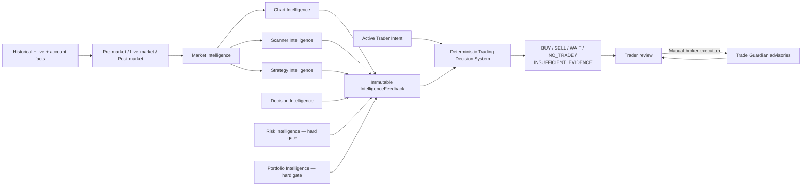

# PredictiveEdge Trading Decision System v0.1

| Field | Value |
|---|---|
| Status | Implementation spike; target authority boundary superseded by v0.2 |
| Date | 2026-08-09 |
| Authority | Advisory recommendation only; no broker-write authority |
| Human boundary | AI recommends; the trader decides |

> **Architecture correction:** The founder-confirmed target is documented in
> [AI Decision Intelligence Architecture v0.2](./AI-Decision-Intelligence-Architecture-v0.2.md).
> In that target, Chart, Scanner and Strategy publish factual resources rather
> than `BUY`/`SELL`; AI Decision Intelligence is the sole recommendation
> authority. The v0.1 deterministic directional coordinator must be refactored.

## 1. Purpose

The Trading Decision System produces one final, explainable recommendation for
an active `TraderIntent` after reviewing immutable, point-in-time feedback from:

1. Chart Intelligence
2. Scanner Intelligence
3. Strategy Intelligence
4. Decision Intelligence
5. Risk Intelligence
6. Portfolio Intelligence

It does not calculate those modules' specialist evidence and it cannot place,
modify, or cancel an order. Each intelligence authority publishes its own
lineage-bearing assessment; the coordinator applies the governed decision
profile and preserves the exact feedback manifest used for the outcome.

## 2. Boundary and flow

The editable diagram source is
[`diagrams/trading-decision-system-v0.1.mmd`](./diagrams/trading-decision-system-v0.1.mmd).



`TradingDecisionService` obtains every assessment using one knowledge cutoff.
`TradingDecisionEngine` then evaluates the bundle deterministically. Collection
order cannot change the evidence-manifest hash or final outcome.

## 3. Initial governed decision profile

The first profile intentionally favors abstention:

- All six module assessments are mandatory.
- Every assessment must be `READY`, final, available at evaluation time, and
  unexpired.
- Risk and Portfolio must explicitly return `PASS`.
- Any ready module veto returns `NO_TRADE`; confidence cannot override a veto.
- Decision Intelligence supplies the candidate `BUY` or `SELL` direction.
- Chart, Strategy, and Decision must agree on that direction.
- Scanner may agree or return `WAIT`; an opposite Scanner direction conflicts.
- Any directional conflict or required directional abstention returns `WAIT`.
- A direction outside the active Trader Intent returns `NO_TRADE`.
- Missing, stale, provisional, invalid, warm-up, unavailable, or expired
  feedback returns `INSUFFICIENT_EVIDENCE`.
- Directional recommendation confidence is the weakest confidence among Chart,
  Strategy, and Decision, additionally capped by Scanner when Scanner agrees.
  It is an explainability score, not a probability of profit.

## 4. Feedback contract

Each `IntelligenceFeedback` carries:

```text
feedbackId
module
instrument
proposedAction
confidence
readiness
gateDisposition
finalEvidence
analysisCutoff
knowledgeCutoff
availableAt
validUntil
inputManifestHash
reasons
evidenceReferences
```

Risk and Portfolio use `gateDisposition` as their authoritative decision. Their
`proposedAction` can remain `WAIT` because they do not originate trade direction.

## 5. Final recommendation contract

`TradingRecommendation` contains the recommendation and Trader Intent IDs,
instrument, advisory action, confidence, evaluation time, primary reason,
blocking modules, ordered feedback references, and a deterministic SHA-256
evidence-manifest hash.

No executable order or broker command exists in either new module.

## 6. Implemented modules

| Module | Responsibility |
|---|---|
| `trading-decision-domain` | Immutable contracts, validation, deterministic decision policy and evidence hashing |
| `trading-decision-application` | One-cutoff feedback query port and recommendation use case |
| `chart-intelligence-domain` | Conservative interpretation of finalized trend, regime, location, trigger, momentum and participation evidence |
| `chart-intelligence-application` | Mapping of a chart assessment into the shared `IntelligenceFeedback` contract |

## 7. Next increments

1. Connect governed Market Intelligence features to the implemented `ChartSnapshot` input.
2. Add durable append-only feedback and recommendation persistence with outbox events.
3. Add authenticated recommendation-query and trader-review APIs.
4. Connect Scanner, Strategy, Risk and Portfolio implementations incrementally.
5. Add pre-market, live-market and post-market orchestration profiles without
   weakening the common finality, cutoff, veto, and Trader Intent rules.
