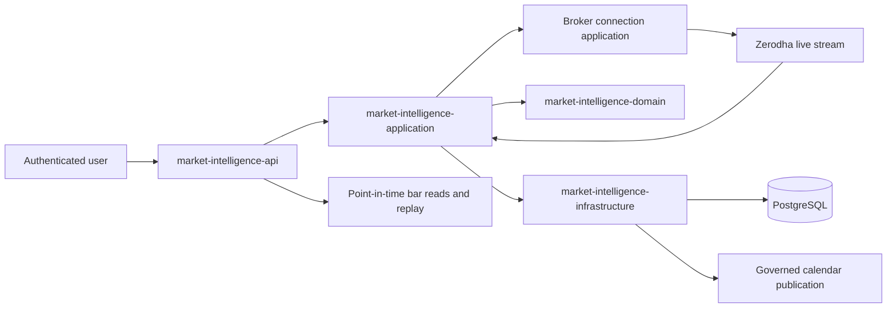
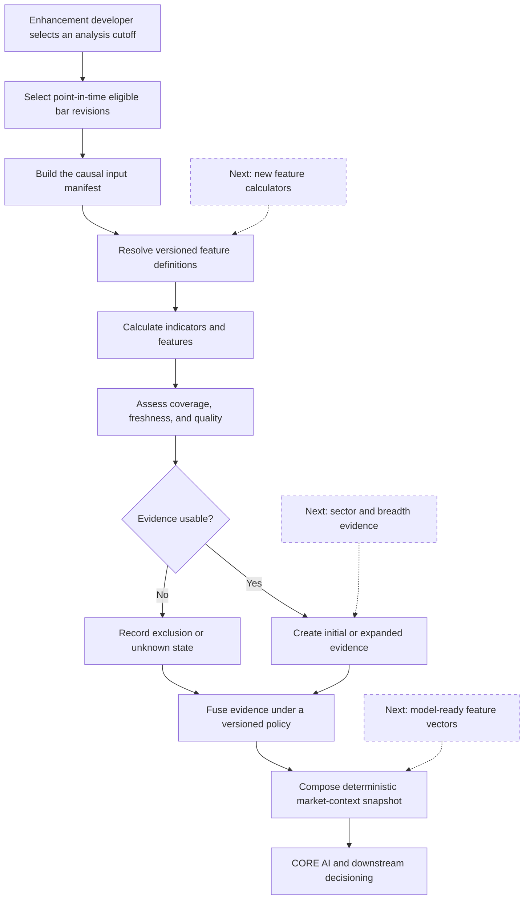
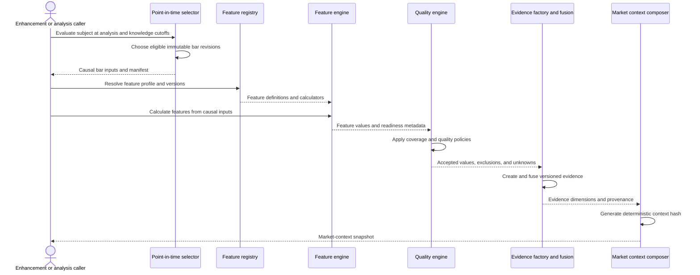
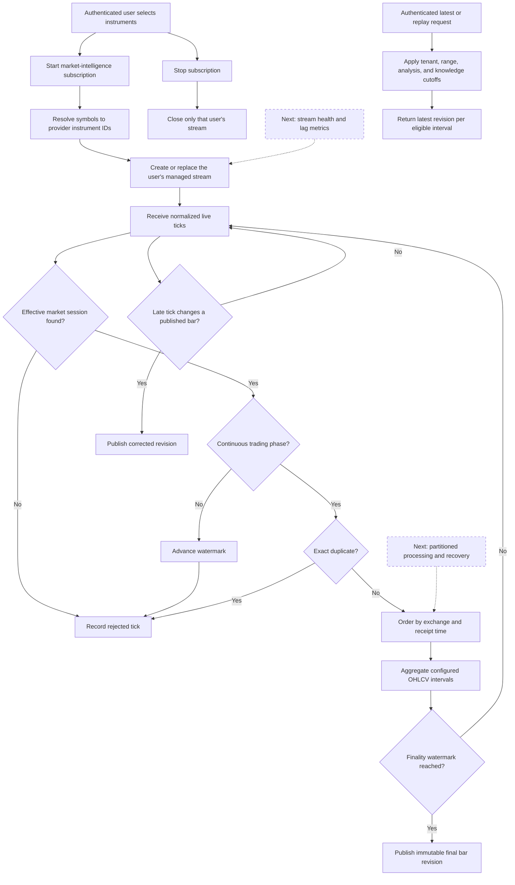
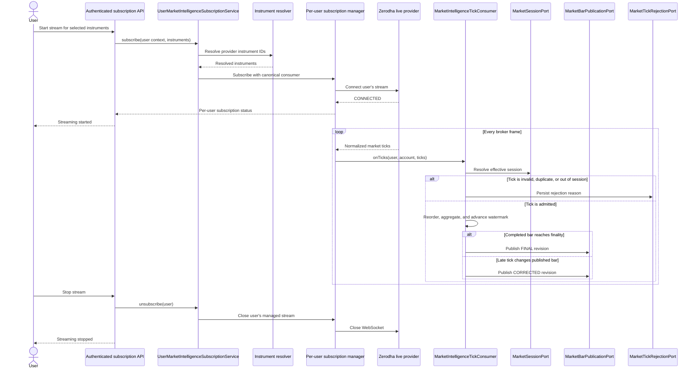
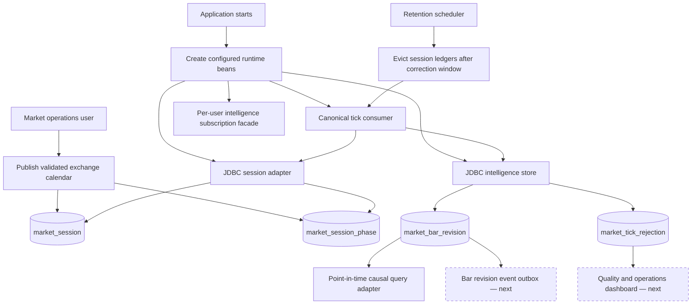
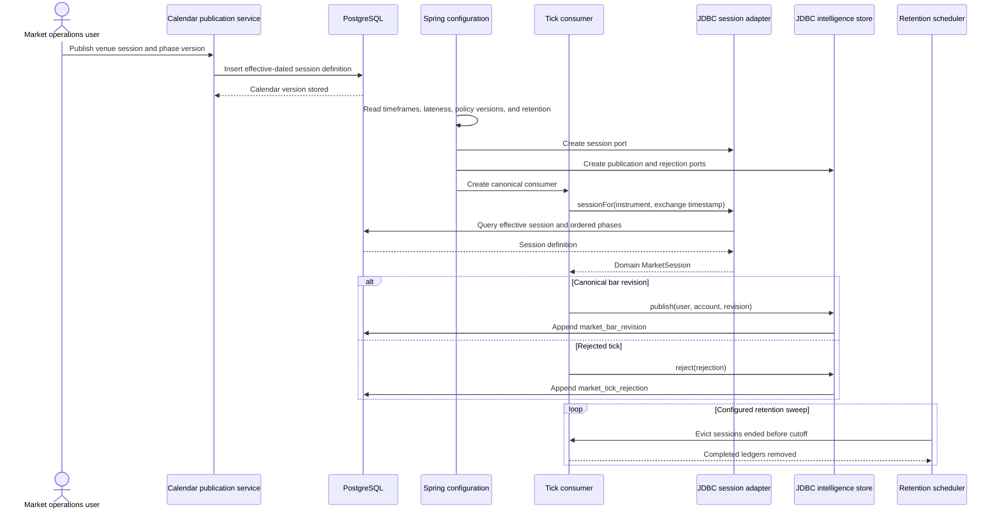
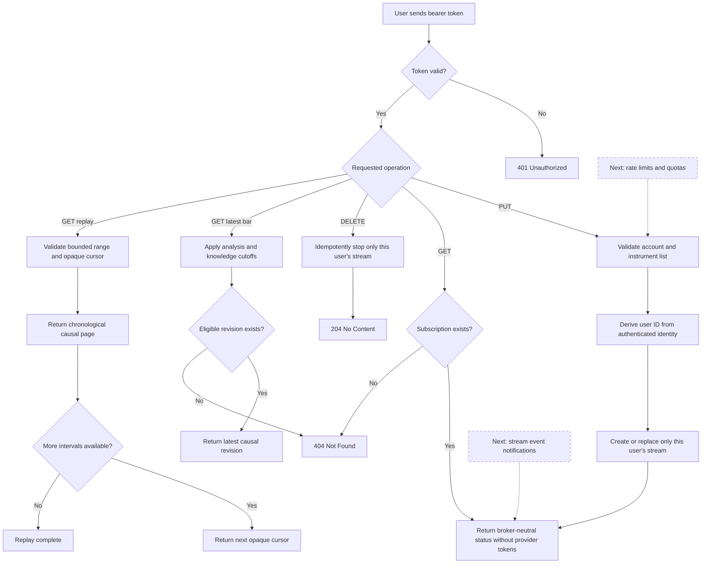
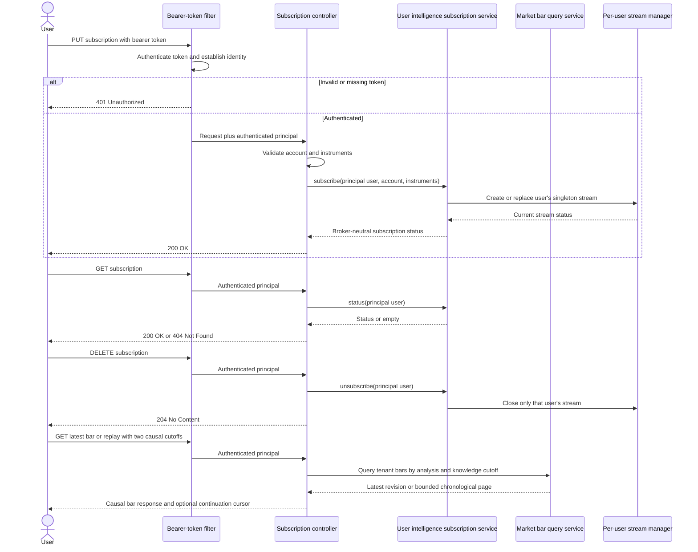
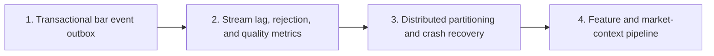

# Market Intelligence — User Flows and Sequences

This reference describes the current responsibility of each market-intelligence module and identifies the clean extension points for the next enhancements.

## 1. Module map

## 2. market-intelligence-domain

### User flow

The domain module owns market-time rules, canonical bar revisions, feature calculation, evidence quality, and deterministic market-context composition. It does not connect to brokers or databases.

### Sequence

## 3. market-intelligence-application

### User flow

The application module coordinates one user's live subscription and converts normalized broker ticks into final or corrected canonical bars.

### Sequence

## 4. market-intelligence-infrastructure

### User and operator flow

The infrastructure module supplies the effective calendar, durable append-only persistence, Spring composition, and bounded in-memory retention.

### Sequence

## 5. market-intelligence-api

### User flow

The API module exposes one subscription resource per authenticated user. User identity is always taken from the verified bearer token and is never accepted from request data.

### Sequence

## 6. Recommended enhancement order

The governed calendar publisher, authenticated subscription commands, and point-in-time bar reads/replay are now implemented. The next enhancement should stage every published bar revision through the transactional outbox for reliable downstream delivery.
