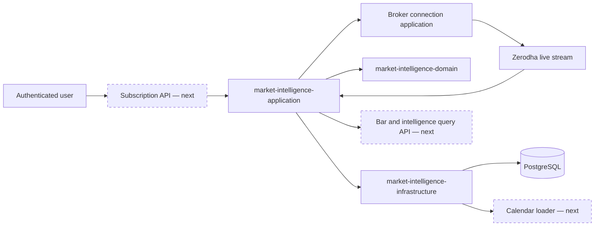
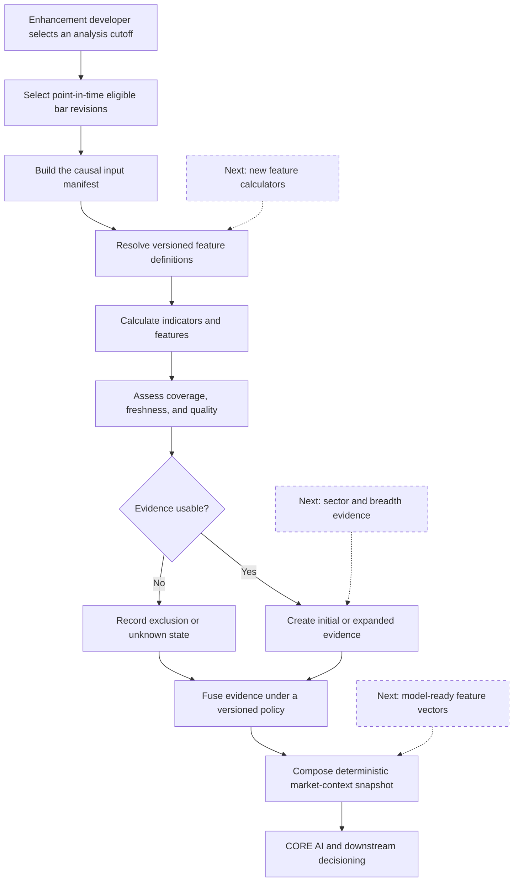
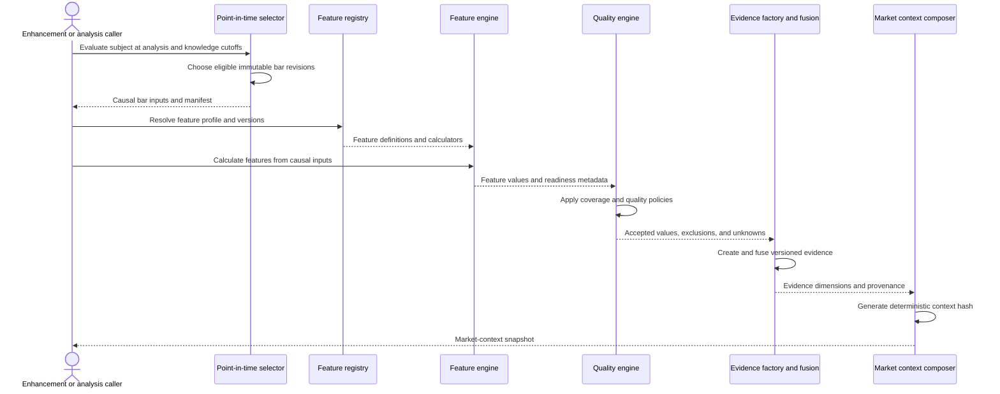
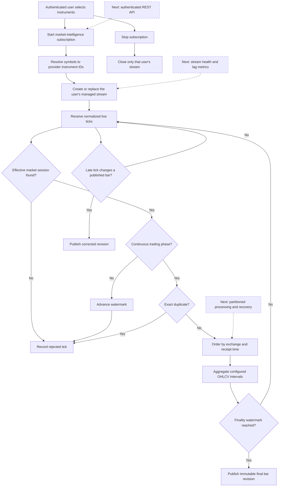
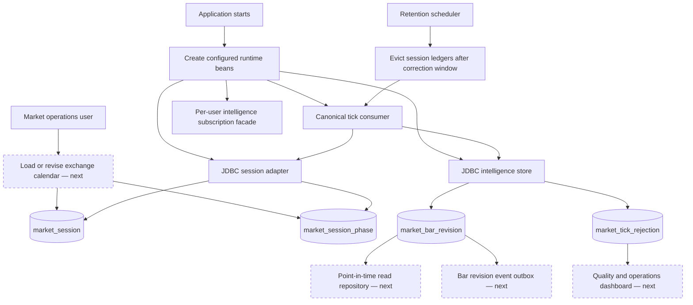
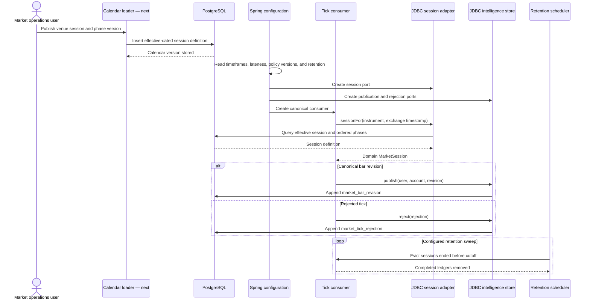
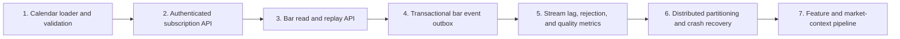

# Market Intelligence — User Flows and Sequences

This reference describes the current responsibility of each market-intelligence module and identifies the clean extension points for the next enhancements.

## 1. Module map

## 2. market-intelligence-domain

### User flow

The domain module owns market-time rules, canonical bar revisions, feature calculation, evidence quality, and deterministic market-context composition. It does not connect to brokers or databases.

### Sequence

## 3. market-intelligence-application

### User flow

The application module coordinates one user's live subscription and converts normalized broker ticks into final or corrected canonical bars.

### Sequence

## 4. market-intelligence-infrastructure

### User and operator flow

The infrastructure module supplies the effective calendar, durable append-only persistence, Spring composition, and bounded in-memory retention.

### Sequence

## 5. Recommended enhancement order

The first enhancement should be the calendar loader because the live consumer intentionally rejects every tick for which no effective session definition exists.
